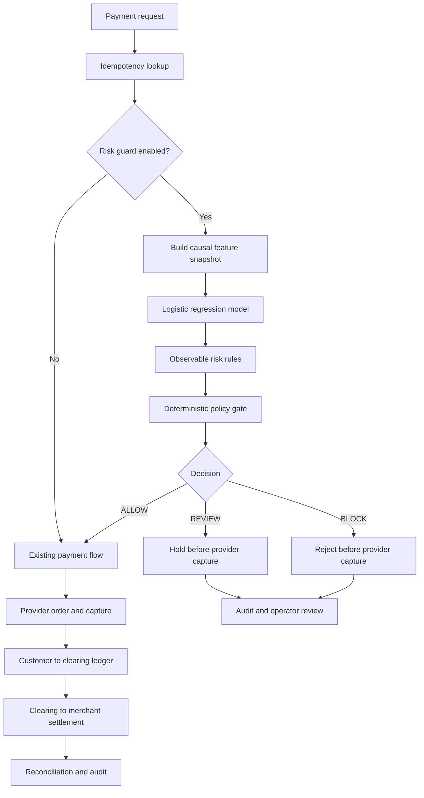
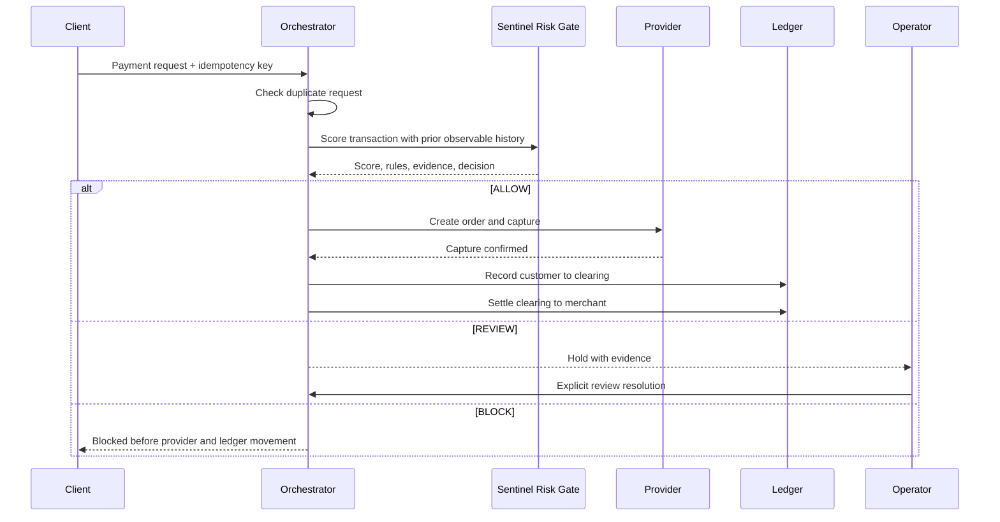
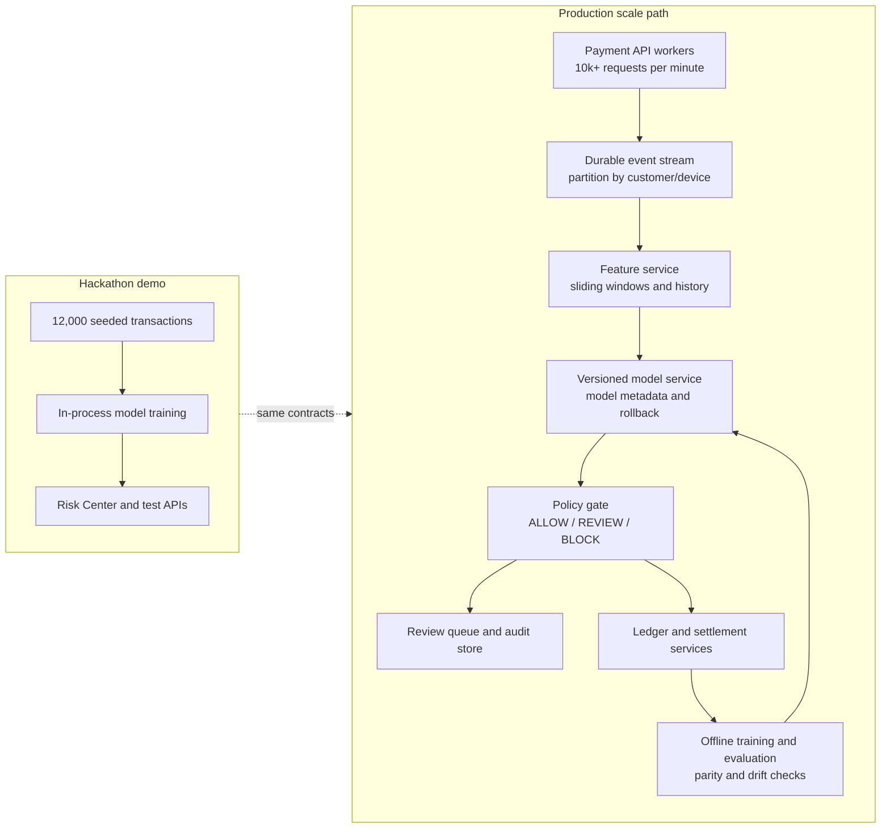

# BankVerse Sentinel

## AI Risk Manager for Payment Infrastructure

BankVerse Sentinel is a defense-only fraud-risk layer for an Indian UPI payment system. It combines a trained, explainable machine-learning detector with observable coordinated-activity analysis and a deterministic payment safety policy.

The central idea is simple:

> The model detects suspicious transactions. BankVerse understands the financial system around them.

Sentinel does not provide offensive security capabilities, does not seize accounts, and does not allow an AI model to authorize money movement.

## Hackathon Summary

| Item             | Answer                                                               |
| ---------------- | -------------------------------------------------------------------- |
| Track fit        | AI/ML-powered defense and risk management                            |
| ML component     | Pure TypeScript logistic regression with L2 regularization           |
| Training data    | 12,000 deterministic synthetic UPI transactions                      |
| Training split   | 70% training, 30% held-out evaluation                                |
| Fraud patterns   | Card-testing bursts, velocity rings, night anomalies, refund abuse   |
| Live decision    | `ALLOW`, `REVIEW`, or `BLOCK`                                        |
| Financial safety | Risk gate executes before provider order creation and ledger booking |
| Data disclosure  | Metrics are synthetic benchmark measurements, not production claims  |
| LLM requirement  | None; an LLM is optional and outside the financial decision path     |

## Why This Matters

Payment systems do not fail only because a classifier misses a fraud transaction. They also fail when:

- suspicious activity is treated as unrelated individual events;
- operators cannot quantify merchant exposure;
- a risk decision happens after money movement;
- duplicated requests create duplicated financial entries;
- provider failures leave the ledger inconsistent;
- model explanations cannot be audited.

Sentinel connects the risk decision to BankVerse's existing payment infrastructure, including idempotency, optimistic concurrency control, the clearing ledger, reconciliation, outbox behavior, and chaos verification.

## What Makes It Different

The underlying algorithm is conventional. Logistic regression is intentionally used because its weights, features, and decisions can be inspected during a hackathon demo.

The system-level differentiation is the combination of:

1. ML-based transaction scoring.
2. Causal, leakage-aware feature construction.
3. Observable shared-device and coordinated-activity rings.
4. Exposure calculation in rupees.
5. Deterministic policy enforcement before provider capture.
6. Preservation of double-entry ledger invariants.
7. A reproducible verification suite instead of invented metrics.

This is not pitched as novel ML research. It is an explainable AI control embedded in payment infrastructure.

## Architecture



### Risk and financial-control boundary



## Mermaid Scale Diagram

This diagram shows the intended scaling shape. The current repository is a deterministic local/serverless demo; the production boxes describe the next deployment boundary rather than claiming that the demo already operates at these volumes.



## Machine-Learning Pipeline

### 1. Synthetic data generation

`lib/risk/dataset.ts` creates deterministic transaction records with:

- customer and payer identifiers;
- merchant and bank identifiers;
- device identifiers;
- INR amount and timestamp;
- payment status;
- evaluation-only fraud label and pattern.

The generator creates four fraud patterns:

- `CARD_TESTING`: repeated low-value attempts in a short window;
- `VELOCITY_RING`: coordinated activity across customers sharing devices;
- `NIGHT_ANOMALY`: unusual high-value activity during night hours;
- `REFUND_ABUSE`: suspicious refund-heavy behavior.

The seed is fixed for reproducibility. No user upload is required for the demo.

### 2. Causal feature engineering

`lib/risk/features.ts` converts each transaction into numeric signals:

- transactions in the last 10 minutes;
- transactions in the last hour;
- distinct merchants in the last 24 hours;
- customer amount deviation;
- low-value burst indicator;
- night-hour indicator;
- new-merchant indicator;
- dormant-account reactivation;
- customer refund ratio;
- device-sharing count.

A transaction may use only strictly earlier transactions. Future rows cannot change an earlier feature snapshot.

### 3. Training and evaluation

The detector trains on the training split and evaluates on a held-out split. Test-time features receive permitted prior history, but test labels are used only after scoring to calculate metrics.

Reported metrics include:

- precision;
- recall;
- F1 score;
- false-positive rate;
- confusion matrix;
- expected INR cost across thresholds.

False-positive and false-negative costs are transparent demo assumptions, not production estimates.

### 4. Explainable output

Every score includes:

- model probability;
- final risk score;
- decision;
- triggered rules;
- top contributing features.

The deterministic policy prevents a low model probability from masking several strong observable risk signals. In the payment gate, multiple triggered signals force review or block according to the configured policy.

## Coordinated Activity and Exposure

`lib/risk/rings.ts` constructs candidate rings from observable signals rather than synthetic labels. A candidate may include:

- shared device;
- multiple customers;
- transaction count;
- involved merchants;
- time window;
- total exposure in INR;
- human-readable evidence.

Synthetic `isFraud` and `fraudPattern` fields are evaluation truth only. They are never required to create a live ring candidate.

Example operator explanation:

```text
ring_1
8 customers shared one device
23 transactions occurred within one hour
2 merchants were involved
Potential exposure: Rs 114,000
Recommended action: REVIEW or BLOCK according to policy
```

## Payment Safety

The opt-in gate lives in `lib/risk/payment-gate.ts` and is inserted into `PaymentOrchestrator.processPayment` after idempotency lookup and before provider order creation.

Enable it with either:

```ts
new PaymentOrchestrator({ riskEnabled: true });
```

or:

```text
BANKVERSE_RISK_GUARD=true
```

The caller can pass prior observable history through `riskHistory`. In the demo, the seeded dataset is used as a fallback when no history is supplied.

Policy behavior:

- `ALLOW`: continue the existing provider and ledger flow;
- `REVIEW`: stop automatic processing and return evidence for an operator;
- `BLOCK`: stop before provider order creation and before any ledger transaction exists.

The risk gate does not bypass idempotency, OCC, reconciliation, or ledger controls.

## Demo Script

1. Open `/risk-center`.
2. Show the held-out evaluation counts and threshold/cost tradeoff.
3. Show a live explained score and the triggered evidence.
4. Show observable coordinated rings, members, merchants, timeline, and exposure.
5. Explain that the model is trained, but the dataset is synthetic and disclosed.
6. Run the payment verification route or the test suite to show a coordinated burst is blocked before provider or ledger movement.
7. Open `/operations` or `/transaction-history` to show that normal financial correctness remains intact.

Recommended spoken pitch:

> A normal fraud model flags a transaction. BankVerse Sentinel connects that signal to the payment system: it finds coordinated exposure, explains the evidence, and stops suspicious activity before provider capture while preserving the ledger's financial invariants.

## Repository Map

| Area                          | Purpose                                           |
| ----------------------------- | ------------------------------------------------- |
| `lib/risk/dataset.ts`         | Seeded synthetic transaction generation and split |
| `lib/risk/features.ts`        | Causal feature extraction                         |
| `lib/risk/model.ts`           | Logistic regression implementation                |
| `lib/risk/rules.ts`           | Explainable defense rules                         |
| `lib/risk/detector.ts`        | Model and rule score combination                  |
| `lib/risk/metrics.ts`         | Evaluation metrics and cost analysis              |
| `lib/risk/rings.ts`           | Label-independent coordinated activity            |
| `lib/risk/payment-gate.ts`    | Payment risk boundary                             |
| `lib/payment/orchestrator.ts` | Provider and ledger payment lifecycle             |
| `components/RiskCenter.tsx`   | Operator-facing Risk Center                       |
| `app/api/risk/evaluate`       | Held-out evaluation report                        |
| `app/api/risk/score`          | Explained score endpoint                          |
| `app/api/risk/rings`          | Coordinated-activity endpoint                     |
| `app/api/risk/threshold`      | Threshold and cost analysis                       |
| `app/api/test-risk`           | Risk verification endpoint                        |
| `app/api/test-payment`        | Payment and risk-gate verification                |

## Run Locally

Prerequisites: Node.js 20 or newer and npm.

```bash
npm install
npm run dev
```

Open:

- `http://localhost:3000/risk-center`
- `http://localhost:3000/api/risk/evaluate`
- `http://localhost:3000/api/risk/rings`
- `http://localhost:3000/api/test-risk`
- `http://localhost:3000/api/test-payment`

Run the complete verification suite:

```bash
npm test
```

The current implementation passes 89 behavioral verification checks. The production build also passes. Repository-wide lint still contains unrelated pre-existing errors outside this feature.

## Data and Model Storage

The demo does not require uploading a dataset or model file.

- Synthetic transactions are generated in memory from a fixed seed.
- Logistic-regression weights are trained lazily and kept in process memory.
- The model is recreated after a cold start.
- Live history can be supplied through the risk-gate contract, but durable risk-history and audit storage remain production work.

For production, add:

- durable transaction and device-history retrieval;
- durable risk decision and feature-snapshot audit records;
- model artifact/version storage;
- scheduled retraining and rollback;
- temporal validation and drift monitoring;
- representative labeled fraud data;
- calibration, fairness review, and human approval controls.

## Limitations and Honesty

This project does not claim production fraud accuracy. The data is synthetic, the fraud patterns are intentionally controlled, and the benchmark demonstrates a reproducible evaluation workflow.

The algorithm is not presented as novel research. The hackathon value is the integration of explainable ML with coordinated financial exposure analysis and payment-system correctness.

An LLM is not required. If added later, it should be a read-only risk investigator that summarizes structured evidence and recommends an action. It must not authorize capture, settlement, account seizure, or any other financial movement.

## Verification

Run:

```bash
npm test
npm run build
```

The most important safety assertions are:

- deterministic dataset generation;
- no future feature leakage;
- no label dependency in ring construction;
- complete held-out metric calculation;
- explainable risk output;
- blocked coordinated activity creates no payment transaction;
- existing ledger, idempotency, OCC, reconciliation, and chaos checks remain green.

## License

See [LICENSE](LICENSE).
