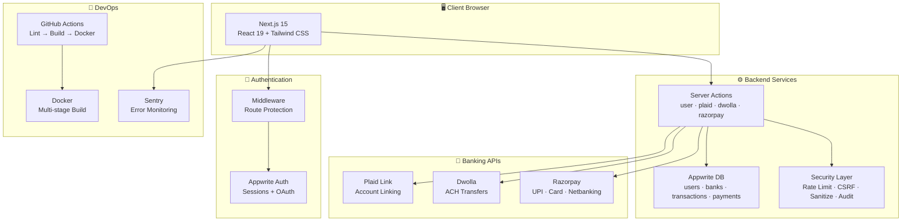
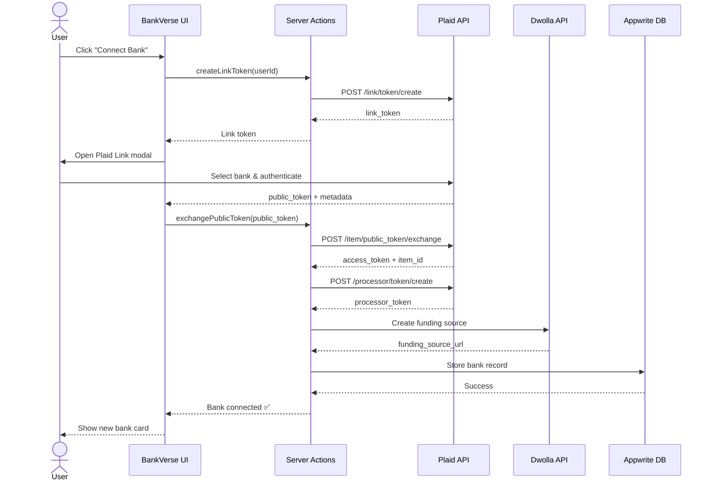
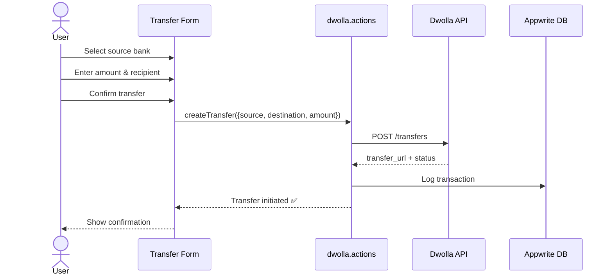
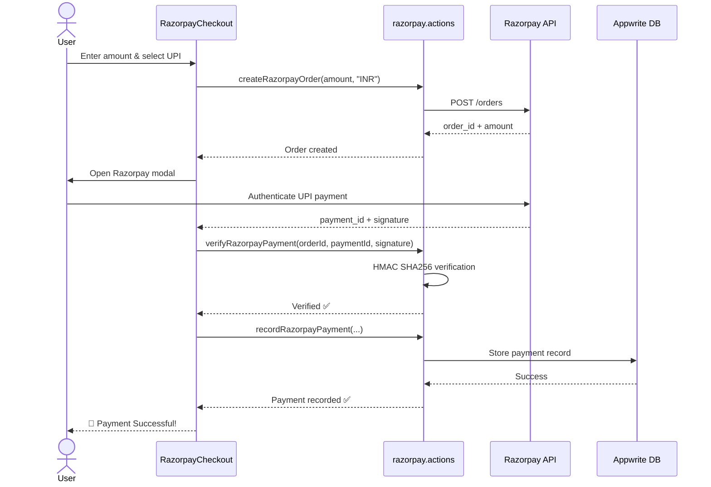
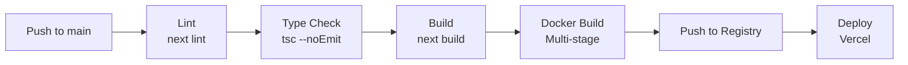

# 🏦 BankVerse — Modern Banking Platform

<div align="center">


<br/>


# 🏦 BankVerse

### *The Open-Source Banking Experience*

**Connect real bank accounts • Send ACH & UPI payments • Track spending with beautiful charts**

[](https://github.com/Script-Kitty01/bankverse)
[](https://opensource.org/licenses/MIT)
[](https://makeapullrequest.com)

[Features](#-features) • [Demo](#-live-demo) • [Architecture](#-architecture) • [Quick Start](#-quick-start) • [Payment Flows](#-payment-flows) • [Tech Stack](#-tech-stack)

</div>

---

## 📖 Overview

BankVerse is a **production-ready, full-stack banking application** that brings the modern fintech experience to the open-source world. Connect real bank accounts via **Plaid**, view your financial dashboard with interactive charts, browse transaction history, and send money through **Dwolla ACH** or **Razorpay UPI** — all from a beautiful, responsive interface.

> 💡 **Demo Mode**: Set `NEXT_PUBLIC_DEMO_MODE=true` and explore the full app with mock data — no API keys needed!



---

## ✨ Features

### 🔐 Authentication & Security
| Feature | Description |
|---------|-------------|
| Email/Password Auth | Secure sign-up & sign-in via Appwrite with session management |
| Route Protection | Middleware-based redirects — unauthenticated users can't access dashboard |
| Demo Mode | `NEXT_PUBLIC_DEMO_MODE=true` skips auth, uses mock data for development |
| Rate Limiting | In-memory rate limiter on server actions (Redis-ready for production) |
| CSRF Protection | Token-based CSRF prevention on all forms |
| Input Sanitization | XSS prevention via HTML escaping |
| Audit Logging | Track sign-ins, transfers, and profile changes |

### 🏦 Banking & Payments
| Feature | Description |
|---------|-------------|
| **Plaid Link** | Connect real bank accounts (Chase, BofA, Wells Fargo, etc.) via Plaid sandbox |
| **Account Balances** | Real-time balance fetching with animated counters |
| **ACH Transfers** | Send money between accounts via Dwolla ACH with multi-step confirmation |
| **Razorpay UPI** | Pay via UPI apps (Google Pay, PhonePe, Paytm) with QR code or UPI ID |
| **Razorpay Card** | Credit/debit card payments through Razorpay checkout |
| **Razorpay Netbanking** | Direct bank transfers via Indian netbanking |
| **Razorpay Wallet** | Wallet payments (Paytm, Mobikwik, etc.) |

### 📊 Dashboard & Analytics
| Feature | Description |
|---------|-------------|
| Total Balance | Sum across all linked accounts with count-up animation |
| Spending by Category | Interactive doughnut chart with color-coded categories |
| Net Worth Trend | Line chart showing balance changes over time |
| Recent Transactions | Latest 10 transactions with channel badges and category tags |

### 💳 Account Management
| Feature | Description |
|---------|-------------|
| Bank Cards | Visual card display with masked account numbers and bank logos |
| Connect / Disconnect | Add new banks or remove existing connections |
| Multiple Accounts | Support for checking, savings, credit, and investment accounts |

### 📋 Transaction History
| Feature | Description |
|---------|-------------|
| Full History | Paginated, searchable transaction log across all accounts |
| Channel Badges | Color-coded badges: 🟣 UPI, 🟠 Card, 🔵 Netbanking, ⚪ Online, 🟡 In Store |
| Category Tags | Visual category chips (Food, Travel, Shopping, Transfer, etc.) |
| Status Indicators | Pending / Completed status with animated badges |

### 📱 User Experience
| Feature | Description |
|---------|-------------|
| Responsive Design | Mobile sidebar + adaptive layouts for all screen sizes |
| Loading States | Skeleton loaders on every page for smooth UX |
| SEO Optimized | Dynamic sitemap, robots.txt, per-page metadata |
| Dark Mode Ready | Tailwind-based theming infrastructure |

---

## � Live Demo

### 🏠 Dashboard
```
┌──────────────────────────────────────────────────────────┐
│  🏦 BankVerse    🔍 Search...         👤 John Doe       │
│──────────────────────────────────────────────────────────│
│                                                          │
│  Welcome, John                    ┌──────────────────┐  │
│  Access & manage your accounts    │  Chase Bank      │  │
│                                   │  ****4821        │  │
│  ┌─────────────────────────┐      │  $4,820.50       │  │
│  │ Total Balance           │      └──────────────────┘  │
│  │ $17,621.25              │      ┌──────────────────┐  │
│  │ 2 Bank Accounts         │      │  Wells Fargo     │  │
│  └─────────────────────────┘      │  ****9075        │  │
│                                   │  $12,800.75      │  │
│  📊 Spending by Category          └──────────────────┘  │
│  ┌─────────────────────┐                                 │
│  │   🍕 Food   35%     │                                 │
│  │   🛒 Shop   25%     │                                 │
│  │   💸 Trans  20%     │                                 │
│  │   ✈️ Travel 20%     │                                 │
│  └─────────────────────┘                                 │
│                                                          │
│  📋 Recent Transactions                                  │
│  ┌──────────────────────────────────────────────────┐   │
│  │ Starbucks  🟡in store  -$12.50  ✓  Jul 31  🍕   │   │
│  │ Amazon     ⚪online    -$89.99  ✓  Jul 30  🛒   │   │
│  │ UPI Trans  🟣UPI       -$2,500  ✓  Jul 18  💸   │   │
│  └──────────────────────────────────────────────────┘   │
└──────────────────────────────────────────────────────────┘
```

### 💸 Payment Transfer — Dual Payment Methods

```
┌──────────────────────────────────────────────────────────┐
│  💸 Payment Transfer                                     │
│  ┌─────────────────────┬─────────────────────────────┐   │
│  │ 🏦 Bank Transfer    │ 📱 Razorpay / UPI  ◀ active │   │
│  └─────────────────────┴─────────────────────────────┘   │
│                                                          │
│  Amount (INR)                                            │
│  ┌──────────────────────────────────────────────────┐   │
│  │ 2,500                                            │   │
│  └──────────────────────────────────────────────────┘   │
│                                                          │
│  Payment Method                                          │
│  ┌──────────────┐ ┌──────────────┐                      │
│  │ 📱 UPI  ✓   │ │ 💳 Card     │                      │
│  └──────────────┘ └──────────────┘                      │
│  ┌──────────────┐ ┌──────────────┐                      │
│  │ 🏦 Netbank  │ │ 👛 Wallet   │                      │
│  └──────────────┘ └──────────────┘                      │
│                                                          │
│  ┌──────────────────────────────────────────────────┐   │
│  │         Pay ₹2,500 via UPI                       │   │
│  └──────────────────────────────────────────────────┘   │
└──────────────────────────────────────────────────────────┘
```

### 📱 UPI QR Code Payment

```
┌──────────────────────────────────────────────────────────┐
│  💸 Payment Transfer                                     │
│                                                          │
│  Amount (INR): 2,500                                     │
│                                                          │
│  ┌──────────────────────────────────────────────────┐   │
│  │                                                  │   │
│  │              ████████████████████                │   │
│  │              ██ ▄▄▄▄▄ ██▀▀█ ██                │   │
│  │              ██ █   █ ██▀▀█ ██                │   │
│  │              ██ ▀▀▀▀▀ ██  █ ██                │   │
│  │              ██▀▀▀▀▀▀▀▀█ ▀▀██                │   │
│  │              ████████████████████                │   │
│  │                                                  │   │
│  │     Scan with any UPI app to pay                 │   │
│  │                                                  │   │
│  │     ┌──────────────────────────┐                 │   │
│  │     │ 📱 bankverse@upi    📋   │                 │   │
│  │     └──────────────────────────┘                 │   │
│  │                                                  │   │
│  └──────────────────────────────────────────────────┘   │
│                                                          │
│  ┌──────────────────────────────────────────────────┐   │
│  │         Simulate UPI Payment ₹2,500              │   │
│  └──────────────────────────────────────────────────┘   │
└──────────────────────────────────────────────────────────┘
```

---

## �🏗️ Architecture

```mermaid
flowchart LR
    subgraph Routes["📄 App Router"]
        direction TB
        Auth["(auth)/<br/>sign-in · sign-up"]
        Root["(root)/<br/>dashboard · my-banks<br/>transaction-history<br/>payment-transfer · profile"]
        API["api/health"]
    end

    subgraph Components["🧩 Components"]
        direction TB
        Layout["Sidebar · MobileNav · HeaderBox"]
        Cards["BankCard · TotalBalanceBox"]
        Charts["DoughnutChart · AnimatedCounter"]
        Forms["AuthForm · TransferForm<br/>RazorpayCheckout · UpiQrCode"]
        Data["TransactionsTable · Pagination · RightSidebar"]
    end

    subgraph DataLayer["📦 Data Layer"]
        direction TB
        Actions["Server Actions<br/>user · plaid · dwolla · razorpay"]
        SDK["Appwrite SDK<br/>auth · config · db"]
        External["Plaid API · Dwolla API · Razorpay API"]
    end

    subgraph Security["🛡️ Security"]
        direction TB
        Rate["Rate Limiter"]
        CSRF["CSRF Tokens"]
        Sanitize["Input Sanitization"]
        Audit["Audit Logger"]
    end

    Routes --> Components
    Components --> DataLayer
    DataLayer --> Security
```



### Data Flow: Connecting a Bank Account



### Data Flow: ACH Transfer



### Razorpay UPI Payment Flow



---

## 💸 Payment Flows

BankVerse supports **two payment rails** — choose based on your region and needs:

| | 🏦 Dwolla ACH | 📱 Razorpay / UPI |
|---|---|---|
| **Region** | United States | India |
| **Speed** | 1-3 business days | Instant |
| **Methods** | Bank-to-bank ACH | UPI, Card, Netbanking, Wallet |
| **Currency** | USD | INR |
| **Best for** | Large transfers, payroll | Everyday payments, e-commerce |
| **Fees** | Low / Free | Competitive per-transaction |

### Switching Payment Methods

The `TransferForm` component renders a tabbed interface:

```tsx
// Payment method tabs in TransferForm.tsx
<button onClick={() => setPaymentMethod("ach")}>
  🏦 Bank Transfer (ACH)
</button>
<button onClick={() => setPaymentMethod("razorpay")}>
  📱 Razorpay / UPI
</button>

// Conditional rendering
{paymentMethod === "ach" && <ACHTransferForm />}
{paymentMethod === "razorpay" && <RazorpayCheckout />}
```

---

## 🚀 Quick Start

### Prerequisites

| Tool | Version | Purpose |
|------|---------|---------|
| Node.js | 20+ | Runtime |
| npm | 10+ | Package manager |

> 💡 **No API keys needed for demo mode!** Just clone, install, and run.

### 1. Clone & Install

```bash
git clone https://github.com/Script-Kitty01/bankverse.git
cd bankverse
npm install
```

### 2. Environment Variables

Create `.env.local` (or use the existing one with demo mode):

```bash
# ========== Demo Mode ==========
# Set to "true" to skip auth & use mock data
NEXT_PUBLIC_DEMO_MODE=true

# ========== Appwrite ==========
NEXT_PUBLIC_APPWRITE_ENDPOINT=https://cloud.appwrite.io/v1
NEXT_PUBLIC_APPWRITE_PROJECT_ID=your-project-id
NEXT_PUBLIC_APPWRITE_DATABASE_ID=your-database-id
APPWRITE_API_KEY=your-api-key

# ========== Plaid (optional) ==========
PLAID_CLIENT_ID=your-client-id
PLAID_SECRET=your-sandbox-secret
PLAID_ENV=sandbox

# ========== Dwolla (optional) ==========
DWOLLA_KEY=your-dwolla-key
DWOLLA_SECRET=your-dwolla-secret
DWOLLA_ENV=sandbox

# ========== Razorpay (optional) ==========
RAZORPAY_KEY_ID=rzp_test_xxx
RAZORPAY_KEY_SECRET=xxx
NEXT_PUBLIC_RAZORPAY_KEY_ID=rzp_test_xxx

# ========== Sentry (optional) ==========
NEXT_PUBLIC_SENTRY_DSN=your-sentry-dsn
```

### 3. Run Development Server

```bash
npm run dev
```

Open [http://localhost:3000](http://localhost:3000) 🎉

### 4. Docker (Production)

```bash
docker compose up --build
```

The app will be available at `http://localhost:3000` with:
- ✅ Non-root user (`nextjs:nodejs`)
- ✅ Health check endpoint at `/api/health`
- ✅ Multi-stage optimized image

---

## �️ Tech Stack

| Layer | Technology | Why |
|-------|-----------|-----|
| **Framework** | Next.js 15 (App Router) | Server components, streaming, Turbopack |
| **Language** | TypeScript 5 (strict) | Type safety, better DX |
| **UI** | React 19 | Latest React with server components |
| **Styling** | Tailwind CSS 3.4 + shadcn/ui | Utility-first, accessible components |
| **Forms** | react-hook-form + zod | Performant forms with schema validation |
| **Charts** | Chart.js + react-chartjs-2 | Doughnut, line, and bar charts |
| **Animations** | react-countup | Animated number counters |
| **Auth** | Appwrite | Managed auth with sessions |
| **Database** | Appwrite DB | Document database with real-time |
| **Bank Linking** | Plaid API | Bank account linking + transactions |
| **ACH Payments** | Dwolla API | US bank-to-bank transfers |
| **UPI Payments** | Razorpay | Indian UPI, Card, Netbanking, Wallet |
| **Monitoring** | Sentry | Error tracking (client + server + edge) |
| **CI/CD** | GitHub Actions | Automated lint, build, docker |
| **Container** | Docker (multi-stage) | Production-ready Alpine image |
| **Icons** | Lucide React | Consistent, tree-shakeable icon set |

---

## 📁 Project Structure

```
bankverse/
├── app/
│   ├── (auth)/                        # 🔓 Public routes
│   │   ├── layout.tsx                 # Auth layout wrapper
│   │   ├── sign-in/page.tsx           # Sign-in form
│   │   └── sign-up/page.tsx           # Sign-up form
│   ├── (root)/                        # 🔒 Protected routes
│   │   ├── layout.tsx                 # Sidebar + mobile nav
│   │   ├── page.tsx                   # Dashboard home
│   │   ├── my-banks/                  # Connected accounts
│   │   ├── payment-transfer/          # ACH + Razorpay/UPI
│   │   ├── profile/                   # User settings
│   │   └── transaction-history/       # Full transaction log
│   ├── api/health/route.ts            # Health check endpoint
│   ├── globals.css                    # Global styles + Tailwind
│   └── layout.tsx                     # Root layout
├── components/
│   ├── ui/                            # shadcn/ui primitives
│   │   ├── button.tsx
│   │   ├── form.tsx
│   │   ├── input.tsx
│   │   ├── label.tsx
│   │   └── sheet.tsx
│   ├── AnimatedCounter.tsx            # Count-up animation
│   ├── AuthForm.tsx                   # Sign-in/up form
│   ├── BankCard.tsx                   # Visual bank card
│   ├── CustomInput.tsx                # Form input wrapper
│   ├── DoughnutChart.tsx              # Spending by category
│   ├── HeaderBox.tsx                  # Page header
│   ├── MobileNav.tsx                  # Mobile navigation
│   ├── RazorpayCheckout.tsx           # Razorpay payment UI
│   ├── RightSidebar.tsx               # Dashboard sidebar
│   ├── Sidebar.tsx                    # Main navigation
│   ├── TotalBalanceBox.tsx            # Balance summary
│   ├── TransactionsTable.tsx          # Transaction list with badges
│   ├── TransferForm.tsx               # ACH + Razorpay tabs
│   └── UpiQrCode.tsx                  # UPI QR code payment
├── lib/
│   ├── actions/                       # Server actions
│   │   ├── dwolla.actions.ts          # Dwolla ACH operations
│   │   ├── plaid.actions.ts           # Plaid account operations
│   │   ├── razorpay.actions.ts        # Razorpay payment operations
│   │   └── user.actions.ts            # Auth + user operations
│   ├── appwrite/                      # Appwrite SDK
│   │   ├── auth.ts                    # Session management
│   │   ├── config.ts                  # Client initialization
│   │   └── db.ts                      # Database CRUD + mock data
│   └── utils.ts                       # Shared utilities
├── constants/index.ts                 # App constants + nav links
├── middleware.ts                       # Auth route protection
├── types/index.d.ts                   # TypeScript declarations
├── docker-compose.yml                 # Docker Compose config
├── Dockerfile                         # Multi-stage Docker build
├── .github/workflows/                 # CI/CD pipelines
├── next.config.ts                     # Next.js configuration
├── tailwind.config.ts                 # Tailwind configuration
├── tsconfig.json                      # TypeScript configuration
└── package.json                       # Dependencies + scripts
```

---

## 🔒 Security

BankVerse implements multiple layers of security:

| Mechanism | File | Description |
|-----------|------|-------------|
| **Rate Limiting** | `lib/security/rate-limit.ts` | In-memory rate limiter (Redis-ready for production) |
| **CSRF Protection** | `lib/security/csrf.ts` | Token-based CSRF prevention for forms |
| **Input Sanitization** | `lib/security/sanitize.ts` | XSS prevention via HTML escaping |
| **Audit Logging** | `lib/security/audit.ts` | Track sign-ins, transfers, profile changes |
| **Middleware** | `middleware.ts` | Route protection + auth redirects |
| **Non-root User** | `Dockerfile` | Container runs as `nextjs:nodejs` |
| **Health Check** | `app/api/health/` | Monitoring endpoint for orchestration |
| **Demo Mode Guard** | All server actions | `NEXT_PUBLIC_DEMO_MODE` check before calling external APIs |

---

## 🚢 CI/CD Pipeline



### GitHub Actions Workflows

- **`ci.yml`** — Runs on every push: lint → type-check → build → docker build
- **`deploy.yml`** — Deploys to Vercel on main branch pushes

---

## 🧪 API Reference

### Health Check

```http
GET /api/health
```

**Response:**
```json
{
  "status": "healthy",
  "timestamp": "2026-08-01T12:00:00.000Z",
  "uptime": 3600.123,
  "environment": "production"
}
```

### Server Actions

| Action | File | Description |
|--------|------|-------------|
| `signUp()` | `user.actions.ts` | Create account + Appwrite session |
| `signIn()` | `user.actions.ts` | Email/password sign-in |
| `signOut()` | `user.actions.ts` | Delete current session |
| `getCurrentUser()` | `user.actions.ts` | Get logged-in user from session |
| `createLinkToken()` | `plaid.actions.ts` | Generate Plaid Link token |
| `exchangePublicToken()` | `plaid.actions.ts` | Exchange for access token |
| `getAccounts()` | `plaid.actions.ts` | Fetch linked bank accounts |
| `getTransactions()` | `plaid.actions.ts` | Fetch transaction history |
| `createTransfer()` | `dwolla.actions.ts` | Initiate ACH transfer |
| `createDwollaCustomer()` | `dwolla.actions.ts` | Create Dwolla customer |
| `createRazorpayOrder()` | `razorpay.actions.ts` | Create Razorpay payment order |
| `verifyRazorpayPayment()` | `razorpay.actions.ts` | Verify HMAC payment signature |
| `recordRazorpayPayment()` | `razorpay.actions.ts` | Record payment in database |

---

## 🎯 Roadmap

- [x] Plaid bank account linking
- [x] Dwolla ACH transfers
- [x] Razorpay UPI / Card / Netbanking / Wallet
- [x] Interactive dashboard with charts
- [x] Demo mode for development
- [x] Docker + CI/CD
- [ ] Real-time transaction notifications (WebSocket)
- [ ] Bill pay & recurring payments
- [ ] Budget tracking & goals
- [ ] Multi-currency support
- [ ] Mobile app (React Native)
- [ ] AI-powered spending insights

---

## 🤝 Contributing

Contributions are welcome! Please feel free to submit a Pull Request.

1. Fork the repository
2. Create your feature branch (`git checkout -b feature/amazing-feature`)
3. Commit your changes (`git commit -m 'Add amazing feature'`)
4. Push to the branch (`git push origin feature/amazing-feature`)
5. Open a Pull Request

---

## 📄 License

This project is licensed under the MIT License — see the [LICENSE](LICENSE) file for details.

---

<div align="center">

**Built with ❤️ using Next.js, Appwrite, Plaid, Dwolla & Razorpay**

⭐ **Star this repo** if you find it useful!

[⬆ Back to Top](#-bankverse--modern-banking-platform)

</div>
