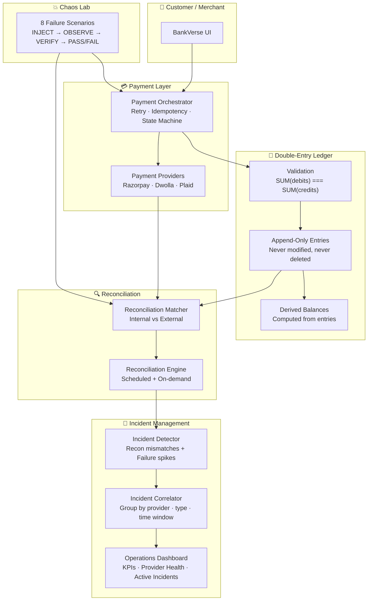
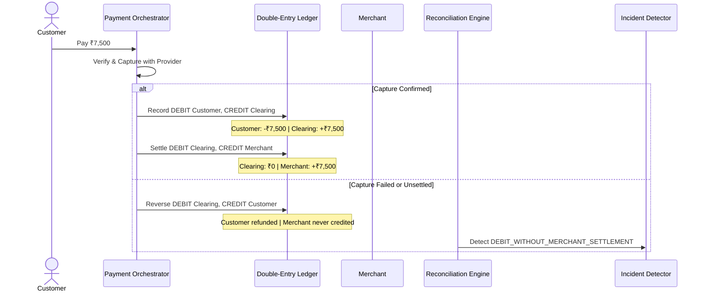

# 🛡️ BankVerse — Payment Reliability Platform

<div align="center">


<br/>


# 🛡️ BankVerse

### _BankVerse reduces the operational cost and customer impact of payment failures._

**Double-entry ledger • Automated reconciliation • Chaos engineering • Incident management**

[](https://github.com/Script-Kitty01/bankverse)
[](https://opensource.org/licenses/MIT)
[](https://makeapullrequest.com)

[Why BankVerse](#-why-bankverse) • [Reliability Architecture](#-reliability-architecture) • [Quick Start](#-quick-start) • [Features](#-features) • [Tech Stack](#-tech-stack)

</div>

---

## 💡 Why BankVerse

Payment failures cost businesses **2-5% of revenue** in lost customers, manual reconciliation, and compliance penalties. Most banking apps treat failures as exceptions. BankVerse treats them as **expected events** and builds the infrastructure to detect, contain, and recover from them automatically.

| Problem                                                | BankVerse Solution                                                                                                                                                        |
| ------------------------------------------------------ | ------------------------------------------------------------------------------------------------------------------------------------------------------------------------- |
| "Where did the money go?"                              | **Double-entry ledger** — every paisa is accounted for. SUM(debits) === SUM(credits) enforced at transaction time.                                                        |
| "The provider says success but we show failure"        | **Automated reconciliation** — internal ledger vs provider records, with structured mismatch evidence.                                                                    |
| "1,200 failed transactions, 1,200 alerts"              | **Incident correlation** — groups related failures by provider, type, and time window into single actionable incidents.                                                   |
| "How do we know the system actually handles failures?" | **Chaos engineering** — 8 failure scenarios (timeout, mismatch, duplicate, missing credit, webhook disorder, provider down, bulk mismatch, race condition) run on demand. |
| "How do we prove to auditors?"                         | **Append-only ledger** — entries are never modified or deleted. Reversals create new entries. Full audit trail.                                                           |

---

## 🏗️ Reliability Architecture



### The Clearing Account & Settlement Lifecycle

To guarantee that a merchant is **never credited before provider capture is confirmed**, BankVerse uses a three-legged booking model through a system Clearing account (`system:clearing`):



---

## 🚀 Quick Start

### Prerequisites

| Tool    | Version | Purpose         |
| ------- | ------- | --------------- |
| Node.js | 20+     | Runtime         |
| npm     | 10+     | Package manager |

> 💡 **No API keys needed for demo mode!** Just clone, install, and run.

### 1. Clone & Install

```bash
git clone https://github.com/Script-Kitty01/bankverse.git
cd bankverse
npm install
```

### 2. Environment Variables

Create `.env.local`:

```bash
# ========== Demo Mode ==========
NEXT_PUBLIC_DEMO_MODE=true

# ========== Appwrite (optional for production) ==========
NEXT_PUBLIC_APPWRITE_ENDPOINT=https://cloud.appwrite.io/v1
NEXT_PUBLIC_APPWRITE_PROJECT_ID=your-project-id
NEXT_PUBLIC_APPWRITE_DATABASE_ID=your-database-id
APPWRITE_API_KEY=your-api-key

# ========== Payment Providers (optional) ==========
PLAID_CLIENT_ID=your-client-id
PLAID_SECRET=your-sandbox-secret
DWOLLA_KEY=your-dwolla-key
DWOLLA_SECRET=your-dwolla-secret
RAZORPAY_KEY_ID=rzp_test_xxx
RAZORPAY_KEY_SECRET=xxx
NEXT_PUBLIC_RAZORPAY_KEY_ID=rzp_test_xxx

# ========== Sentry (optional) ==========
NEXT_PUBLIC_SENTRY_DSN=your-sentry-dsn
```

### 3. Run

```bash
npm run dev
```

Open [http://localhost:3000](http://localhost:3000).

### 4. Run the Test Suite

```bash
# All 39 tests across 6 phases
curl http://localhost:3000/api/test-ledger          # Phase 1: 7 tests
curl http://localhost:3000/api/test-payment         # Phase 2: 10 tests
curl http://localhost:3000/api/test-reconciliation  # Phase 3: 7 tests
curl http://localhost:3000/api/test-chaos           # Phase 4: 8 tests
curl http://localhost:3000/api/test-operations      # Phase 5: 7 tests
curl http://localhost:3000/api/test-debit-without-credit  # E2E: DEBIT_WITHOUT_CREDIT
```

### 5. Docker (Production)

```bash
docker compose up --build
```

---

## ✨ Features

### 🛡️ Payment Reliability (Core)

| Feature                          | Description                                                                                                                                                      |
| -------------------------------- | ---------------------------------------------------------------------------------------------------------------------------------------------------------------- |
| **Double-Entry Ledger**          | Append-only entries. SUM(debits) === SUM(credits) enforced. Reversals create new entries, never modify originals.                                                |
| **Automated Reconciliation**     | Match internal ledger against provider records. Structured mismatch evidence (AMOUNT_MISMATCH, MISSING_INTERNAL, DEBIT_WITHOUT_CREDIT, DUPLICATE).               |
| **Dual-Dimension State Machine** | PaymentState (CREATED→PROCESSING→SUCCESS/FAILED) + SettlementState (NOT_REQUIRED→PENDING_RECONCILIATION→RECONCILING→RESOLVED/REFUNDED).                          |
| **Idempotency**                  | Duplicate payment requests return the same transaction. No double-charges.                                                                                       |
| **Chaos Engineering**            | 8 failure scenarios: provider timeout, amount mismatch, duplicate charge, missing credit, webhook disorder, provider down, bulk mismatch, refund race condition. |
| **Incident Correlation**         | Groups related failures by provider + mismatch type + 5-min time window. 1,200 broken transactions = 1 incident, not 1,200.                                      |
| **Operations Dashboard**         | Real-time KPIs: success rate, total volume, active incidents, reconciliation match rate, provider health.                                                        |

### 🔐 Authentication & Security

| Feature             | Description                                                               |
| ------------------- | ------------------------------------------------------------------------- |
| Email/Password Auth | Secure sign-up & sign-in via Appwrite with session management             |
| Route Protection    | Middleware-based redirects — unauthenticated users can't access dashboard |
| Demo Mode           | `NEXT_PUBLIC_DEMO_MODE=true` skips auth, uses mock data                   |
| Rate Limiting       | In-memory rate limiter on server actions (Redis-ready)                    |
| CSRF Protection     | Token-based CSRF prevention on all forms                                  |
| Input Sanitization  | XSS prevention via HTML escaping                                          |
| Audit Logging       | Track sign-ins, transfers, and profile changes                            |

### 🏦 Banking & Payments

| Feature                 | Description                                                |
| ----------------------- | ---------------------------------------------------------- |
| **Plaid Link**          | Connect real bank accounts via Plaid sandbox               |
| **ACH Transfers**       | Send money via Dwolla ACH                                  |
| **Razorpay UPI**        | Pay via UPI apps (Google Pay, PhonePe, Paytm) with QR code |
| **Razorpay Card**       | Credit/debit card payments                                 |
| **Razorpay Netbanking** | Direct bank transfers via Indian netbanking                |

### 📊 Dashboard & Analytics

| Feature              | Description                                               |
| -------------------- | --------------------------------------------------------- |
| Total Balance        | Sum across all linked accounts with count-up animation    |
| Spending by Category | Interactive doughnut chart                                |
| Net Worth Trend      | Line chart showing balance changes over time              |
| Recent Transactions  | Latest transactions with channel badges and category tags |

---

## 📁 Project Structure

```
bankverse/
├── app/
│   ├── (auth)/                        # 🔓 Public routes
│   │   ├── sign-in/page.tsx
│   │   └── sign-up/page.tsx
│   ├── (root)/                        # 🔒 Protected routes
│   │   ├── page.tsx                   # Dashboard
│   │   ├── my-banks/                  # Connected accounts
│   │   ├── payment-transfer/          # ACH + Razorpay/UPI
│   │   ├── transaction-history/       # Full transaction log
│   │   └── profile/                   # User settings
│   └── api/
│       ├── health/route.ts
│       ├── test-ledger/route.ts       # Phase 1 tests
│       ├── test-payment/route.ts      # Phase 2 tests
│       ├── test-reconciliation/route.ts # Phase 3 tests
│       ├── test-chaos/route.ts        # Phase 4 tests
│       ├── test-operations/route.ts   # Phase 5 tests
│       └── test-debit-without-credit/ # E2E test
├── components/
│   ├── ui/                            # shadcn/ui primitives
│   └── ...                            # UI components
├── lib/
│   ├── ledger/                        # 📒 Double-entry ledger
│   │   ├── ledger.service.ts          # Orchestration (public API)
│   │   ├── repository.ts              # Data access (demo + Appwrite)
│   │   ├── validation.ts              # Invariants (double-entry)
│   │   ├── balance.ts                 # Derived balance computation
│   │   └── types.ts                   # Type definitions
│   ├── payment/                       # 💳 Payment orchestration
│   │   ├── orchestrator.ts            # Full lifecycle with retries
│   │   ├── state-machine.ts           # Dual-dimension FSM
│   │   └── mock.provider.ts           # Test provider
│   ├── reconciliation/                # 🔍 Automated reconciliation
│   │   ├── engine.ts                  # Reconciliation runner
│   │   ├── matcher.ts                 # Internal vs external matching
│   │   └── types.ts                   # Reconciliation types
│   ├── incidents/                     # 🚨 Incident management
│   │   ├── detector.ts                # Incident detection
│   │   └── correlator.ts              # Incident grouping
│   ├── chaos/                         # 💥 Chaos engineering
│   │   ├── scenarios.ts               # 8 failure scenarios
│   │   └── injector.ts                # Chaos injection engine
│   ├── security/                      # 🛡️ Security
│   │   ├── rate-limit.ts
│   │   ├── csrf.ts
│   │   ├── sanitize.ts
│   │   └── audit.ts
│   └── actions/                       # Server actions
├── middleware.ts
├── docker-compose.yml
├── Dockerfile
└── package.json
```

---

## 🧪 Test Suite

BankVerse ships with **39 automated tests** across 6 phases:

| Phase | Endpoint                         | Tests | What it verifies                                                                                                                           |
| ----- | -------------------------------- | ----- | ------------------------------------------------------------------------------------------------------------------------------------------ |
| 1     | `/api/test-ledger`               | 7     | Double-entry recording, idempotency, reversals, derived balances, integrity                                                                |
| 2     | `/api/test-payment`              | 10    | State machine transitions, mock provider, full payment flow, refunds, 100 concurrent OCC race test                                        |
| 3     | `/api/test-reconciliation`       | 7     | Internal/external matching, mismatch detection, evidence generation                                                                        |
| 4     | `/api/test-chaos`                | 8     | Provider timeout, amount mismatch, duplicate charge, missing credit, webhook disorder, provider down, bulk mismatch, refund race condition |
| 5     | `/api/test-operations`           | 7     | Incident detection, reconciliation incidents, operations snapshot, incident lifecycle, API endpoint, provider health, incident correlation |
| E2E   | `/api/test-debit-without-credit` | 1     | Full DEBIT_WITHOUT_CREDIT lifecycle: payment → detection → incident → recovery → resolution                                                |

---

## 🛠️ Tech Stack

| Layer            | Technology                              | Why                                     |
| ---------------- | --------------------------------------- | --------------------------------------- |
| **Framework**    | Next.js 16 (App Router)                 | Server components, streaming, Turbopack |
| **Language**     | TypeScript 5 (strict)                   | Type safety                             |
| **UI**           | React 19 + Tailwind CSS 3.4 + shadcn/ui | Accessible, utility-first               |
| **Forms**        | react-hook-form + zod                   | Schema validation                       |
| **Charts**       | Chart.js + react-chartjs-2              | Analytics visualization                 |
| **Auth**         | Appwrite                                | Managed auth with sessions              |
| **Database**     | Appwrite DB                             | Document database                       |
| **Bank Linking** | Plaid API                               | Account linking + transactions          |
| **ACH Payments** | Dwolla API                              | US bank-to-bank transfers               |
| **UPI Payments** | Razorpay                                | Indian UPI, Card, Netbanking            |
| **Monitoring**   | Sentry                                  | Error tracking (client + server + edge) |
| **CI/CD**        | GitHub Actions                          | Lint → Build → Docker                   |
| **Container**    | Docker (multi-stage)                    | Production-ready Alpine image           |

---

## 🔒 Security

| Mechanism              | File                         | Description                                |
| ---------------------- | ---------------------------- | ------------------------------------------ |
| **Rate Limiting**      | `lib/security/rate-limit.ts` | In-memory rate limiter (Redis-ready)       |
| **CSRF Protection**    | `lib/security/csrf.ts`       | Token-based CSRF prevention                |
| **Input Sanitization** | `lib/security/sanitize.ts`   | XSS prevention                             |
| **Audit Logging**      | `lib/security/audit.ts`      | Track sign-ins, transfers, profile changes |
| **Middleware**         | `middleware.ts`              | Route protection + auth redirects          |
| **Non-root User**      | `Dockerfile`                 | Container runs as `nextjs:nodejs`          |
| **Health Check**       | `app/api/health/`            | Monitoring endpoint                        |

---

## 🎯 Roadmap

- [x] Double-entry ledger with append-only entries
- [x] Payment orchestrator with state machine
- [x] Automated reconciliation engine
- [x] Chaos engineering (8 failure scenarios)
- [x] Incident detection + correlation
- [x] Operations dashboard
- [x] DEBIT_WITHOUT_CREDIT end-to-end recovery
- [ ] Real-time WebSocket notifications for incidents
- [ ] Redis-backed rate limiting for production
- [ ] PostgreSQL adapter for ledger (alongside Appwrite)
- [ ] Scheduled reconciliation (cron-based)
- [ ] PagerDuty / Slack incident alerts
- [ ] Multi-currency ledger support
- [ ] SOC 2 compliance evidence export

---

## 🤝 Contributing

Contributions are welcome! Please feel free to submit a Pull Request.

1. Fork the repository
2. Create your feature branch (`git checkout -b feature/amazing-feature`)
3. Commit your changes (`git commit -m 'Add amazing feature'`)
4. Push to the branch (`git push origin feature/amazing-feature`)
5. Open a Pull Request

---

## 📄 License

MIT License — see [LICENSE](LICENSE).

---

<div align="center">

**Built with ❤️ using Next.js, Appwrite, Plaid, Dwolla & Razorpay**

⭐ **Star this repo** if you find it useful!

[⬆ Back to Top](#%EF%B8%8F-bankverse--payment-reliability-platform)

</div>
