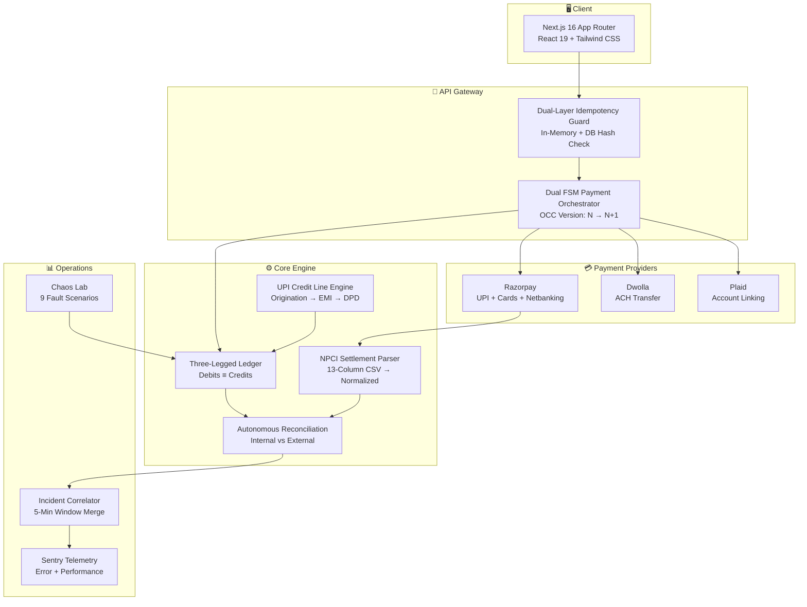
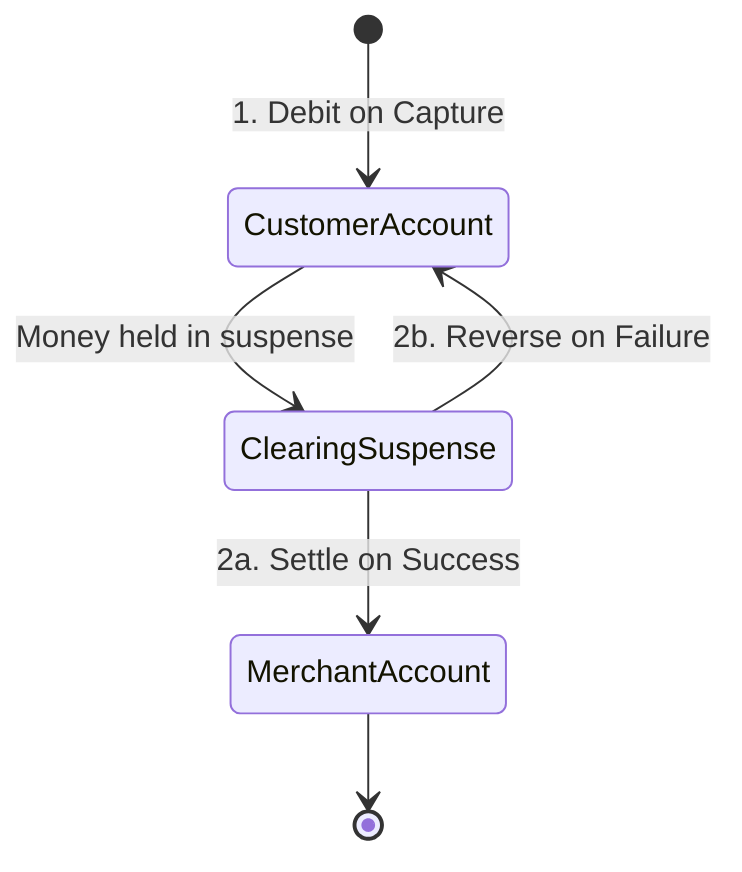
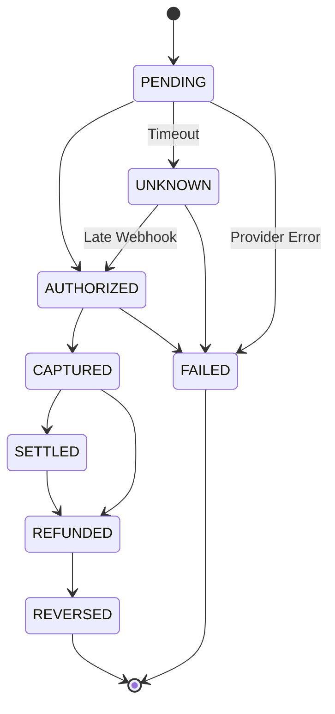

# 🏦 BankVerse — Payment Reliability & Settlement Infrastructure

<div align="center">

[](https://bankverse.vercel.app)
[](https://github.com/Script-Kitty01/bankverse)

<br />

[](https://nextjs.org)
[](https://react.dev)
[](https://www.typescriptlang.org)
[](https://tailwindcss.com)
[](https://razorpay.com)
[](https://supabase.com)
[](https://www.docker.com)
[](https://github.com/Script-Kitty01/bankverse)

</div>

> Hackathon submission: [BankVerse Sentinel](HACKATHON_README.md) documents the AI/ML risk detector, payment safety boundary, demo flow, scale architecture, and limitations.

---

## 🎯 What Problem Does This Solve?

> **The $200B Settlement Problem**: Payment failures cost global enterprises billions annually in lost volume, manual compliance interventions, and ghost balance discrepancies.

When a payment provider says "success", your system says "failure", and money is somewhere in between — **who fixes it?** Most banking apps treat payment exceptions as unhandled runtime errors. BankVerse treats them as **baseline execution conditions**.

### Built for FINTECH UPI Credit Card Infrastructure

This project models the exact payment reliability challenges faced by any **FINTECH** operating UPI-linked credit cards:

| FINTECH Challenge                                              | BankVerse Solution                                                                                               |
| -------------------------------------------------------------- | ---------------------------------------------------------------------------------------------------------------- |
| Thousands of daily UPI repayments via NPCI settlement files    | **NPCI Settlement Parser** — auto-parses 13-column CSV, reconciles against internal ledger                       |
| Credit line lifecycle (origination → draw → EMI → delinquency) | **UPI Credit Line Engine** — compound interest, EMI amortization, repayment waterfall, DPD tracking              |
| Payment provider timeouts causing ghost balances               | **Three-Legged Clearing Ledger** — money stays in `CLEARING_SUSPENSE` until external confirmation                |
| Race conditions under high concurrency                         | **Optimistic Concurrency Control** — version-locked mutations prevent double-settlement                          |
| Manual end-of-month reconciliation                             | **Autonomous Reconciliation Engine** — continuous matching with `AMOUNT_MISMATCH` & `MISSING_INTERNAL` detection |
| Alert fatigue from isolated failures                           | **Incident Correlator** — merges failure spikes within 5-min windows into single actionable incidents            |

---

## 🏛️ Architecture



### Three-Legged Clearing Ledger



### Payment State Machine



---

## 🚀 Live Demo

**[🔗 bankverse.vercel.app](https://bankverse.vercel.app)**

The live deployment includes:

- **Dashboard** (`/`) — Total balance, spending analytics, linked accounts
- **Payment Transfer** (`/payment-transfer`) — IMPS/NEFT bank transfer + Razorpay UPI/Cards/Netbanking checkout
- **Chaos Lab** (`/chaos-lab`) — Interactive fault injection engine (9 scenarios)
- **Operations** (`/operations`) — Real-time incident correlation & provider health
- **My Banks** (`/my-banks`) — Plaid account linking & card management
- **Transaction History** (`/transaction-history`) — Full paginated double-entry audit log
- **Profile** (`/profile`) — User profile & settings

> **Demo Mode**: Authentication is simulated. Razorpay uses **live test mode keys** (`rzp_test_*`) — real Razorpay checkout opens with test cards.

---

## 🧪 Chaos Engineering Lab (9 Scenarios — All Passing)

| #   | Scenario               | Injected Fault                     | Financial Invariant                               |
| --- | ---------------------- | ---------------------------------- | ------------------------------------------------- |
| 01  | `PROVIDER_TIMEOUT`     | Gateway socket hangs 30s           | Transaction → `UNKNOWN`; no credit until verified |
| 02  | `AMOUNT_MISMATCH`      | Provider amount ≠ internal ledger  | Reconciliation flags `AMOUNT_MISMATCH`            |
| 03  | `DUPLICATE_CHARGE`     | 10 parallel webhook calls          | Idempotency absorbs 9 duplicates; 1 settlement    |
| 04  | `MISSING_CREDIT`       | DB write fails after debit         | Transactional rollback; zero balance skew         |
| 05  | `OUT_OF_ORDER_WEBHOOK` | `REFUND` arrives before `CAPTURED` | FSM blocks illegal transition                     |
| 06  | `PROVIDER_DOWN`        | Provider returns HTTP 503          | Failover triggers; transaction marked `FAILED`    |
| 07  | `SLOW_RECONCILIATION`  | 1,000 delayed ledger entries       | Batch matching without memory leaks               |
| 08  | `WORKER_CRASH`         | Server crashes after DB commit     | Outbox pattern recovers event on restart          |
| 09  | `REFUND_RACE`          | Concurrent settlement & refund     | OCC lock: exactly 1 winner                        |

---

## 💻 Tech Stack

| Layer          | Technology                                                          |
| -------------- | ------------------------------------------------------------------- |
| **Framework**  | Next.js 16 (App Router, Turbopack, Server Actions)                  |
| **UI**         | React 19, Tailwind CSS 3.4, shadcn/ui, Lucide Icons                 |
| **Charts**     | Chart.js via react-chartjs-2                                        |
| **Forms**      | React Hook Form + Zod validation                                    |
| **Database**   | Supabase (PostgreSQL) with SSR auth                                 |
| **Payments**   | Razorpay (UPI/Cards/Netbanking), Dwolla (ACH), Plaid (Account Link) |
| **Monitoring** | Sentry (error tracking + performance)                               |
| **Container**  | Docker multi-stage build, docker-compose                            |
| **Testing**    | 87 automated API tests across 10 phases                             |
| **Deployment** | Vercel (production), Docker (self-hosted)                           |

---

## ⚡ Quick Start

### Prerequisites

- **Node.js** ≥ v20
- **npm** ≥ v10

### Setup

```bash
git clone https://github.com/Script-Kitty01/bankverse.git
cd bankverse
npm install
cp .env.example .env.local   # Configure your keys
npm run dev                    # → http://localhost:3000
```

### Run Tests

```bash
npm test   # 87/87 passing across 10 verification phases
```

### Docker

```bash
docker build -t bankverse:latest .
docker-compose up -d
```

---

## 📡 API Reference

### Core Routes

| Method     | Endpoint                         | Description                           |
| ---------- | -------------------------------- | ------------------------------------- |
| `GET`      | `/api/health`                    | System health (DB, Sentry, Gateways)  |
| `GET/POST` | `/api/chaos`                     | Chaos scenario execution              |
| `GET/POST` | `/api/operations`                | Operations metrics & incidents        |
| `GET`      | `/api/reconciliation`            | Trigger reconciliation engine         |
| `POST`     | `/api/webhooks/razorpay`         | Razorpay webhook (signature verified) |
| `POST`     | `/api/webhooks/payment-provider` | Generic gateway webhook               |

### Test Suite (10 Phases, 87 Tests)

| Phase | Endpoint                         | Coverage                                 | Tests |
| ----- | -------------------------------- | ---------------------------------------- | ----- |
| 1     | `/api/test-ledger`               | Double-Entry Ledger & Balance Invariants | 7/7   |
| 2     | `/api/test-payment`              | State Machine & 100-Concurrent OCC Race  | 15/15 |
| 3     | `/api/test-reconciliation`       | Internal vs External Matcher             | 7/7   |
| 4     | `/api/test-chaos`                | Fault Injection & Invariant Verification | 9/9   |
| 5     | `/api/test-operations`           | Incident Correlation & Provider Health   | 7/7   |
| 6     | `/api/test-ingest`               | Transaction Log Ingestion & Auto-Solve   | 7/7   |
| 7     | `/api/test-normalized-ingest`    | Normalized Ingestion Pipeline            | 6/6   |
| 8     | `/api/test-debit-without-credit` | E2E Recovery Lifecycle                   | 1/1   |
| 9     | `/api/test-npci-settlement`      | NPCI Settlement Reconciliation           | 10/10 |
| 10    | `/api/test-credit`               | Credit Line Engine (UPI Credit Card)     | 18/18 |

---

## 🔒 Security

| Domain        | Implementation               | Strategy                              |
| ------------- | ---------------------------- | ------------------------------------- |
| Rate Limiting | `lib/security/rate-limit.ts` | Sliding window API protection         |
| CSRF          | `lib/security/csrf.ts`       | Token-based mutating endpoint defense |
| XSS           | `lib/security/sanitize.ts`   | Strict HTML/string sanitization       |
| Audit         | `lib/security/audit.ts`      | Immutable event trail                 |
| Auth          | Middleware + Supabase SSR    | Edge route guard                      |

---

## 📄 License

MIT — see `LICENSE` for details.

---

<div align="center">

**[🔗 Live Demo](https://bankverse.vercel.app)** · **[📦 GitHub](https://github.com/Script-Kitty01/bankverse)**

Built for high-reliability fintech systems

</div>
