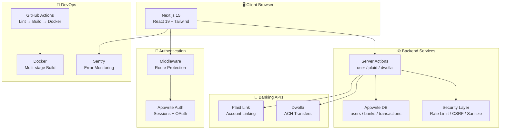
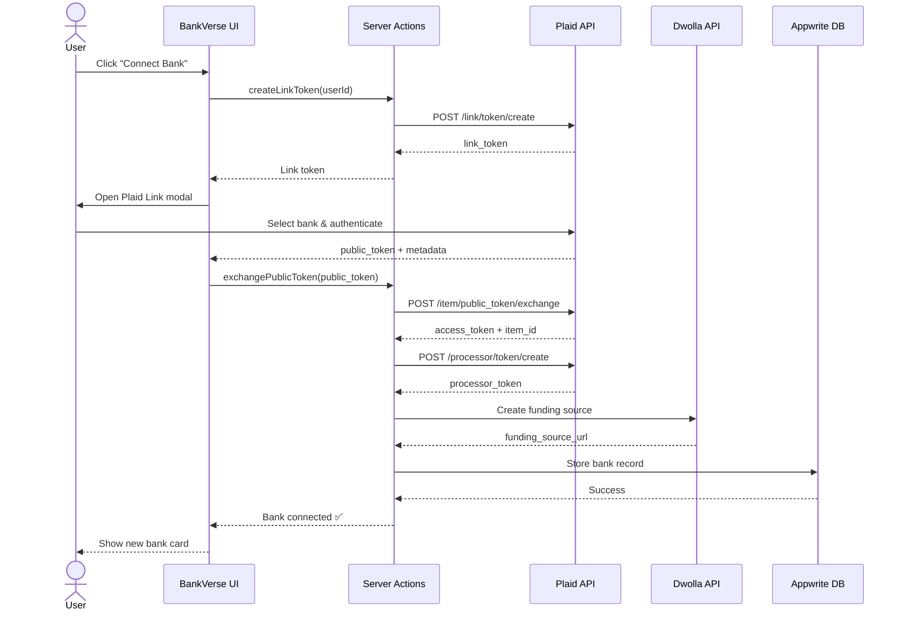
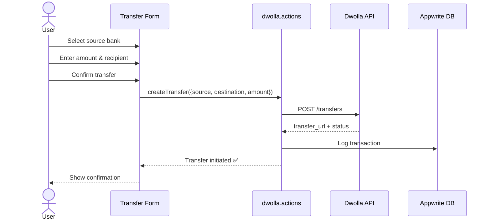
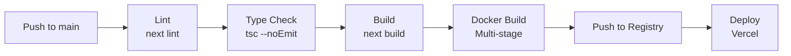

# 🏦 BankVerse — Modern Banking Platform

<div align="center">


**A production-ready, full-stack banking application with real bank account linking, ACH transfers, and financial analytics.**

[Features](#-features) • [Architecture](#-architecture) • [Quick Start](#-quick-start) • [Screenshots](#-screenshots) • [Tech Stack](#-tech-stack)

</div>

---

## 📖 Overview

BankVerse is a modern, secure banking platform that lets users connect real bank accounts via **Plaid**, view their financial dashboard with interactive charts, browse transaction history, and send money via **Dwolla** ACH transfers. Built with **Next.js 15 App Router**, **TypeScript strict mode**, and **Appwrite** for authentication and database.



---

## ✨ Features

| Category | Feature | Description |
|----------|---------|-------------|
| 🔐 **Auth** | Sign Up / Sign In | Secure email/password auth via Appwrite with session management |
| 🔐 **Auth** | Route Protection | Middleware-based redirects for authenticated/unauthenticated users |
| 🔐 **Auth** | Demo Mode | `NEXT_PUBLIC_DEMO_MODE=true` to skip auth during development |
| 🏦 **Banking** | Plaid Link | Connect real bank accounts (Chase, BofA, etc.) via Plaid sandbox |
| 🏦 **Banking** | Account Balances | Real-time balance fetching from linked accounts |
| 🏦 **Banking** | ACH Transfers | Send money between accounts via Dwolla ACH |
| 📊 **Dashboard** | Financial Overview | Total balance across all accounts with animated counter |
| 📊 **Dashboard** | Spending Charts | Doughnut chart by category + net worth trend line chart |
| 📊 **Dashboard** | Recent Transactions | Latest 10 transactions with category badges |
| 💳 **My Banks** | Bank Cards | Visual card display with masked account numbers |
| 💳 **My Banks** | Connect / Disconnect | Add new banks or remove existing connections |
| 📋 **Transactions** | Full History | Paginated, searchable transaction log |
| 📋 **Transactions** | Category Badges | Color-coded categories (Food, Travel, Shopping, etc.) |
| 💸 **Transfers** | Multi-step Form | Guided transfer flow: select bank → enter amount → confirm |
| 👤 **Profile** | Edit Info | Update name, email, address, phone |
| 👤 **Profile** | Change Password | Secure password change flow |
| 🛡️ **Security** | Rate Limiting | In-memory rate limiter for server actions |
| 🛡️ **Security** | CSRF Protection | Token-based CSRF prevention |
| 🛡️ **Security** | Input Sanitization | XSS prevention via DOMPurify |
| 🛡️ **Security** | Audit Logging | Track sensitive actions (sign-in, transfers, profile changes) |
| 🚀 **DevOps** | CI/CD Pipeline | GitHub Actions: lint → type-check → build → docker |
| 🚀 **DevOps** | Docker | Multi-stage production build (Alpine, non-root user) |
| 🚀 **DevOps** | Health Check | `/api/health` endpoint with uptime + timestamp |
| 🚀 **DevOps** | Sentry | Error tracking across client, server, and edge |
| 📱 **UX** | Responsive | Mobile sidebar + adaptive layouts |
| 📱 **UX** | Loading States | Skeleton loaders on every page |
| 📱 **UX** | SEO | Dynamic sitemap, robots.txt, per-page metadata |

---

## 🏗️ Architecture

```mermaid
flowchart LR
    subgraph Routes["📄 App Router"]
        direction TB
        Auth["(auth)/<br/>sign-in · sign-up"]
        Root["(root)/<br/>dashboard · my-banks<br/>transaction-history<br/>payment-transfer · profile"]
        API["api/health"]
    end

    subgraph Components["🧩 Components"]
        direction TB
        Layout["Sidebar · MobileNav · HeaderBox"]
        Cards["BankCard · TotalBalanceBox"]
        Charts["DoughnutChart · NetWorthChart<br/>SpendingChart · AnimatedCounter"]
        Forms["AuthForm · TransferForm<br/>ProfileForm · PlaidLink"]
        Data["TransactionsTable · Pagination<br/>RecentTransactions · RightSidebar"]
    end

    subgraph DataLayer["📦 Data Layer"]
        direction TB
        Actions["Server Actions<br/>user · plaid · dwolla"]
        SDK["Appwrite SDK<br/>auth · config · db"]
        External["Plaid API · Dwolla API"]
    end

    subgraph Security["🛡️ Security"]
        direction TB
        Rate["Rate Limiter"]
        CSRF["CSRF Tokens"]
        Sanitize["Input Sanitization"]
        Audit["Audit Logger"]
    end

    Routes --> Components
    Components --> DataLayer
    DataLayer --> Security
```



### Data Flow: Connecting a Bank Account



### Data Flow: ACH Transfer



---

## 🚀 Quick Start

### Prerequisites

| Tool | Version | Purpose |
|------|---------|---------|
| Node.js | 20+ | Runtime |
| npm | 10+ | Package manager |
| Appwrite | Cloud or Self-hosted | Auth + Database |
| Plaid | Developer Account | Bank account linking |
| Dwolla | Sandbox Account | ACH transfers |

### 1. Clone & Install

```bash
git clone https://github.com/Script-Kitty01/bankverse.git
cd bankverse
npm install
```

### 2. Environment Variables

Create `.env.local`:

```bash
# ========== Appwrite ==========
NEXT_PUBLIC_APPWRITE_ENDPOINT=https://cloud.appwrite.io/v1
NEXT_PUBLIC_APPWRITE_PROJECT_ID=your-project-id
NEXT_PUBLIC_APPWRITE_DATABASE_ID=your-database-id
APPWRITE_API_KEY=your-api-key

# ========== Plaid ==========
PLAID_CLIENT_ID=your-client-id
PLAID_SECRET=your-sandbox-secret
PLAID_ENV=sandbox

# ========== Dwolla ==========
DWOLLA_KEY=your-dwolla-key
DWOLLA_SECRET=your-dwolla-secret
DWOLLA_ENV=sandbox

# ========== Sentry ==========
NEXT_PUBLIC_SENTRY_DSN=your-sentry-dsn

# ========== Site ==========
NEXT_PUBLIC_SITE_URL=http://localhost:3000
NEXT_PUBLIC_DEMO_MODE=false
```

### 3. Run Development Server

```bash
npm run dev
```

Open [http://localhost:3000](http://localhost:3000) 🎉

### 4. Docker (Production)

```bash
docker compose up --build
```

The app will be available at `http://localhost:3000` with:
- ✅ Non-root user (`nextjs:nodejs`)
- ✅ Health check endpoint at `/api/health`
- ✅ Multi-stage optimized image

---

## 📸 Screenshots

### Dashboard
> Financial overview with total balance, spending charts, and recent transactions.

### My Banks
> View all connected accounts with visual bank cards and real-time balances.

### Transaction History
> Paginated, searchable transaction log with color-coded category badges.

### Payment Transfer
> Multi-step ACH transfer form with bank selection and confirmation.

### Sign In / Sign Up
> Clean auth forms with validation, error handling, and loading states.

---

## 🛠️ Tech Stack

| Layer | Technology | Why |
|-------|-----------|-----|
| **Framework** | Next.js 15 (App Router) | Server components, streaming, Turbopack |
| **Language** | TypeScript 5 (strict) | Type safety, better DX |
| **Styling** | Tailwind CSS 3.4 + shadcn/ui | Utility-first, accessible components |
| **Forms** | react-hook-form + zod | Performant forms with schema validation |
| **Charts** | Chart.js + react-chartjs-2 | Doughnut, line, and bar charts |
| **Auth** | Appwrite | Managed auth with sessions |
| **Database** | Appwrite DB | Document database with real-time |
| **Banking** | Plaid API | Bank account linking + transactions |
| **Payments** | Dwolla API | ACH transfers |
| **Monitoring** | Sentry | Error tracking (client + server + edge) |
| **CI/CD** | GitHub Actions | Automated lint, build, docker |
| **Container** | Docker (multi-stage) | Production-ready Alpine image |
| **Icons** | Lucide React | Consistent icon set |

---

## 📁 Project Structure

```
bankverse/
├── app/
│   ├── (auth)/                    # 🔓 Public routes
│   │   ├── layout.tsx             # Auth layout wrapper
│   │   ├── sign-in/page.tsx       # Sign-in form
│   │   └── sign-up/page.tsx       # Sign-up form
│   ├── (root)/                    # 🔒 Protected routes
│   │   ├── layout.tsx             # Sidebar + mobile nav
│   │   ├── page.tsx               # Dashboard home
│   │   ├── loading.tsx            # Dashboard skeleton
│   │   ├── my-banks/              # Connected accounts
│   │   ├── payment-transfer/      # ACH transfer form
│   │   ├── profile/               # User settings
│   │   └── transaction-history/   # Full transaction log
│   ├── api/health/route.ts        # Health check endpoint
│   ├── robots.ts                  # Dynamic robots.txt
│   ├── sitemap.ts                 # Dynamic sitemap
│   ├── globals.css                # Global styles + Tailwind
│   └── layout.tsx                 # Root layout
├── components/
│   ├── ui/                        # shadcn/ui primitives
│   │   ├── button.tsx
│   │   ├── form.tsx
│   │   ├── input.tsx
│   │   ├── label.tsx
│   │   └── sheet.tsx
│   ├── AnimatedCounter.tsx        # Count-up animation
│   ├── AuthForm.tsx               # Sign-in/up form
│   ├── BankCard.tsx               # Visual bank card
│   ├── DoughnutChart.tsx          # Spending by category
│   ├── HeaderBox.tsx              # Page header
│   ├── LoadingSkeleton.tsx        # Skeleton loader
│   ├── MobileNav.tsx              # Mobile navigation
│   ├── NetWorthChart.tsx          # Net worth trend
│   ├── Pagination.tsx             # Page navigation
│   ├── PlaidLink.tsx              # Plaid Link integration
│   ├── ProfileForm.tsx            # Profile editor
│   ├── RecentTransactions.tsx     # Latest transactions
│   ├── RightSidebar.tsx           # Dashboard sidebar
│   ├── Sidebar.tsx                # Main navigation
│   ├── SpendingChart.tsx          # Spending breakdown
│   ├── TotalBalanceBox.tsx        # Balance summary
│   ├── TransactionsTable.tsx      # Transaction list
│   └── TransferForm.tsx           # ACH transfer form
├── lib/
│   ├── actions/                   # Server actions
│   │   ├── dwolla.actions.ts      # Dwolla ACH operations
│   │   ├── plaid.actions.ts       # Plaid account operations
│   │   └── user.actions.ts        # Auth + user operations
│   ├── appwrite/                  # Appwrite SDK
│   │   ├── auth.ts                # Session management
│   │   ├── config.ts              # Client initialization
│   │   └── db.ts                  # Database CRUD
│   ├── dwolla/config.ts           # Dwolla client
│   ├── plaid/config.ts            # Plaid client
│   ├── security/                  # Security utilities
│   │   ├── audit.ts               # Audit logging
│   │   ├── csrf.ts                # CSRF protection
│   │   ├── rate-limit.ts          # Rate limiting
│   │   └── sanitize.ts            # Input sanitization
│   └── utils.ts                   # Shared utilities
├── constants/index.ts             # App constants + nav links
├── middleware.ts                   # Auth route protection
├── types/index.d.ts               # TypeScript declarations
├── docker-compose.yml             # Docker Compose config
├── Dockerfile                     # Multi-stage Docker build
├── .github/workflows/             # CI/CD pipelines
│   ├── ci.yml                     # Lint → Build → Docker
│   └── deploy.yml                 # Deploy to Vercel
├── sentry.client.config.ts        # Sentry browser config
├── sentry.server.config.ts        # Sentry server config
├── sentry.edge.config.ts          # Sentry edge config
├── next.config.ts                 # Next.js configuration
├── tailwind.config.ts             # Tailwind configuration
├── tsconfig.json                  # TypeScript configuration
└── package.json                   # Dependencies + scripts
```

---

## 🔒 Security

BankVerse implements multiple layers of security:

| Mechanism | File | Description |
|-----------|------|-------------|
| **Rate Limiting** | `lib/security/rate-limit.ts` | In-memory rate limiter (replace with Redis in production) |
| **CSRF Protection** | `lib/security/csrf.ts` | Token-based CSRF prevention for forms |
| **Input Sanitization** | `lib/security/sanitize.ts` | XSS prevention via HTML escaping |
| **Audit Logging** | `lib/security/audit.ts` | Track sign-ins, transfers, profile changes |
| **Middleware** | `middleware.ts` | Route protection + auth redirects |
| **Non-root User** | `Dockerfile` | Container runs as `nextjs:nodejs` |
| **Health Check** | `app/api/health/` | Monitoring endpoint for orchestration |

---

## 🚢 CI/CD Pipeline



### GitHub Actions Workflows

- **`ci.yml`** — Runs on every push: lint → type-check → build → docker build
- **`deploy.yml`** — Deploys to Vercel on main branch pushes

---

## 🧪 API Reference

### Health Check

```http
GET /api/health
```

**Response:**
```json
{
  "status": "healthy",
  "timestamp": "2026-08-01T12:00:00.000Z",
  "uptime": 3600.123,
  "environment": "production"
}
```

### Server Actions

| Action | File | Description |
|--------|------|-------------|
| `signUp()` | `user.actions.ts` | Create account + Appwrite session |
| `signIn()` | `user.actions.ts` | Email/password sign-in |
| `signOut()` | `user.actions.ts` | Delete current session |
| `getCurrentUser()` | `user.actions.ts` | Get logged-in user from session |
| `createLinkToken()` | `plaid.actions.ts` | Generate Plaid Link token |
| `exchangePublicToken()` | `plaid.actions.ts` | Exchange for access token |
| `getAccounts()` | `plaid.actions.ts` | Fetch linked bank accounts |
| `getTransactions()` | `plaid.actions.ts` | Fetch transaction history |
| `createTransfer()` | `dwolla.actions.ts` | Initiate ACH transfer |
| `createDwollaCustomer()` | `dwolla.actions.ts` | Create Dwolla customer |

---

## 🤝 Contributing

Contributions are welcome! Please feel free to submit a Pull Request.

1. Fork the repository
2. Create your feature branch (`git checkout -b feature/amazing-feature`)
3. Commit your changes (`git commit -m 'Add amazing feature'`)
4. Push to the branch (`git push origin feature/amazing-feature`)
5. Open a Pull Request

---

## 📄 License

This project is licensed under the MIT License — see the [LICENSE](LICENSE) file for details.

---

<div align="center">

**Built with ❤️ using Next.js, Appwrite, Plaid & Dwolla**

[⬆ Back to Top](#-bankverse--modern-banking-platform)

</div>
│   ├── appwrite/         # Appwrite config, auth, db
│   ├── plaid/            # Plaid client config
│   ├── dwolla/           # Dwolla client config
│   ├── security/         # Rate limiting, CSRF, sanitization, audit
│   └── utils.ts          # Utility functions
├── constants/            # Sidebar links, categories, etc.
├── types/                # TypeScript type definitions
├── public/icons/         # SVG icons
├── Dockerfile            # Multi-stage production build
├── docker-compose.yml    # Docker Compose config
└── .github/workflows/    # CI/CD pipelines
```

## Scripts

| Command | Description |
|---------|-------------|
| `npm run dev` | Start development server with Turbopack |
| `npm run build` | Production build |
| `npm run start` | Start production server |
| `npm run lint` | Run ESLint |

## License

MIT
