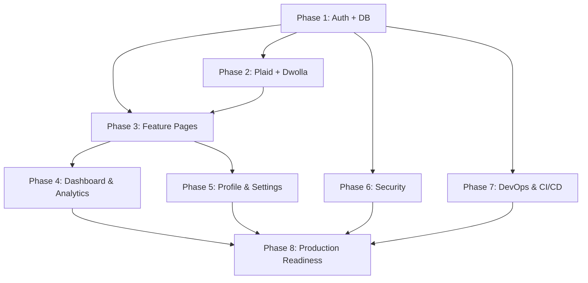

# BankVerse — Full-Stack Implementation Plan

> **Tech Stack:** Next.js 15, TypeScript, Appwrite (Auth + DB), Plaid, Dwolla, Tailwind CSS, shadcn/ui, Chart.js
> **DevOps:** GitHub Actions, Docker, Vercel, Sentry

---

## Phase 1 — Core Backend (Authentication + Database)

### 1.1 Appwrite Setup

- [ ] Create Appwrite Cloud project (or self-hosted instance)
- [ ] Create `bankverse` database with collections:
  - `users` — `$id`, `email`, `userId`, `firstName`, `lastName`, `address1`, `city`, `state`, `postalCode`, `dateOfBirth`, `ssn`, `dwollaCustomerUrl`, `dwollaCustomerId`
  - `banks` — `$id`, `userId`, `accountId`, `bankId`, `accessToken`, `fundingSourceUrl`, `sharableId`
  - `transactions` — `$id`, `accountId`, `name`, `amount`, `category`, `date`, `paymentChannel`, `type`, `pending`, `senderBankId`, `receiverBankId`
- [ ] Set up Appwrite API keys and permissions
- [ ] Create `.env.local` with:
  ```
  NEXT_PUBLIC_APPWRITE_ENDPOINT=https://cloud.appwrite.io/v1
  NEXT_PUBLIC_APPWRITE_PROJECT_ID=xxx
  NEXT_PUBLIC_APPWRITE_DATABASE_ID=xxx
  APPWRITE_API_KEY=xxx
  ```

### 1.2 Appwrite SDK Integration

- [ ] Install `node-appwrite` package
- [ ] Create `lib/appwrite/config.ts` — Appwrite client initialization (server + client)
- [ ] Create `lib/appwrite/auth.ts` — session helpers, `getLoggedInUser()`, `createSession()`, `deleteSession()`
- [ ] Create `lib/appwrite/db.ts` — CRUD helpers for all collections

### 1.3 Real Authentication

- [ ] Rewrite `lib/actions/user.actions.ts`:
  - `signUp()` — create Appwrite account + user document in DB
  - `signIn()` — create Appwrite email/password session
  - `signOut()` — delete current session
  - `getCurrentUser()` — fetch logged-in user from session
- [ ] Add Next.js middleware (`middleware.ts`) to protect `(root)` routes
- [ ] Redirect unauthenticated users to `/sign-in`
- [ ] Replace mock `loggedIn` in `(root)/layout.tsx` with real `getCurrentUser()`
- [ ] Add loading states and error handling to auth flow

### 1.4 Testing — Phase 1

- [ ] Unit tests for `user.actions.ts` (mocked Appwrite SDK)
- [ ] Integration test: sign-up → sign-in → protected route access → sign-out
- [ ] Test middleware redirect behavior

---

## Phase 2 — Plaid + Dwolla Integration

### 2.1 Plaid Link

- [ ] Install `plaid` npm package
- [ ] Create Plaid developer account, get sandbox keys
- [ ] Add to `.env.local`:
  ```
  PLAID_CLIENT_ID=xxx
  PLAID_SECRET=sandbox-xxx
  PLAID_ENV=sandbox
  ```
- [ ] Create `lib/plaid/config.ts` — Plaid client setup
- [ ] Create `lib/actions/plaid.actions.ts`:
  - `createLinkToken()` — generate Plaid Link token for a user
  - `exchangePublicToken()` — exchange public token for access token
  - `getAccounts()` — fetch accounts from Plaid
  - `getTransactions()` — fetch transactions from Plaid
  - `getAccountBalances()` — fetch real-time balances
- [ ] Build `<PlaidLink />` component (replace `{/* plaid link */}` in AuthForm)
- [ ] Store Plaid `accessToken` and `itemId` in Appwrite `banks` collection

### 2.2 Dwolla Integration

- [ ] Create Dwolla sandbox account
- [ ] Add to `.env.local`:
  ```
  DWOLLA_KEY=xxx
  DWOLLA_SECRET=xxx
  DWOLLA_ENV=sandbox
  ```
- [ ] Create `lib/dwolla/config.ts` — Dwolla client
- [ ] Create `lib/actions/dwolla.actions.ts`:
  - `createDwollaCustomer()` — create Dwolla customer for new users
  - `createFundingSource()` — link Plaid processor token to Dwolla
  - `createTransfer()` — initiate ACH transfer
  - `getTransferStatus()` — check transfer status

### 2.3 Testing — Phase 2

- [ ] Unit tests for Plaid actions (mocked Plaid SDK)
- [ ] Unit tests for Dwolla actions (mocked Dwolla SDK)
- [ ] Integration test: Plaid Link flow → exchange token → fetch accounts
- [ ] Integration test: Dwolla transfer flow end-to-end

---

## Phase 3 — Feature Pages

### 3.1 My Banks Page (`/my-banks`)

- [ ] Fetch user's connected banks from Appwrite
- [ ] Display bank cards with real data (balance, mask, institution)
- [ ] Add "Connect New Bank" button → triggers Plaid Link
- [ ] Add "Disconnect Bank" with confirmation dialog
- [ ] Show account type badges (checking, savings, credit)

### 3.2 Transaction History Page (`/transaction-history`)

- [ ] Fetch paginated transactions from Appwrite/Plaid
- [ ] Build `<TransactionsTable />` component with columns:
  - Name, Amount, Date, Category, Status, Channel
- [ ] Add pagination controls (`<Pagination />`)
- [ ] Add filters: date range, category, account, search by name
- [ ] Add sort by: date, amount, name
- [ ] Export transactions as CSV

### 3.3 Payment Transfer Page (`/payment-transfer`)

- [ ] Build transfer form with:
  - Source account dropdown (user's banks)
  - Destination: own account OR external (email/routing number)
  - Amount input with validation
  - Transfer note/description
- [ ] Show real-time balance after source account selection
- [ ] Transfer confirmation step with summary
- [ ] Success page with transaction receipt
- [ ] Transfer history within the page

### 3.4 Testing — Phase 3

- [ ] Component tests for `<TransactionsTable />`, `<Pagination />`
- [ ] E2E test: navigate to My Banks → view accounts
- [ ] E2E test: navigate to Transaction History → filter → paginate
- [ ] E2E test: complete a transfer flow

---

## Phase 4 — Dashboard & Analytics

### 4.1 Homepage Dashboard

- [ ] Replace `RECENT TRANSACTIONS` placeholder with real `<RecentTransactions />` component
- [ ] Show last 5 transactions with click-to-expand detail
- [ ] Add "View All" link to transaction history

### 4.2 Charts & Analytics

- [ ] Spending by category — doughnut chart (already have `<DoughnutChart />`)
- [ ] Monthly income vs expenses — line/bar chart
- [ ] Net worth over time — area chart
- [ ] Top spending categories breakdown

### 4.3 Testing — Phase 4

- [ ] Component tests for chart components
- [ ] Visual regression tests for dashboard layout

---

## Phase 5 — User Profile & Settings

### 5.1 Profile Page (`/profile`)

- [ ] Display and edit user info (name, email, address)
- [ ] Change password flow
- [ ] Profile picture upload

### 5.2 Notifications

- [ ] Email notifications for: large transactions, low balance, transfer complete
- [ ] In-app notification bell with dropdown

### 5.3 Testing — Phase 5

- [ ] Unit tests for profile update actions
- [ ] E2E test: update profile → verify changes persist

---

## Phase 6 — Security Hardening

### 6.1 Authentication Security

- [ ] Rate limiting on sign-in attempts (3 failures → 5 min lockout)
- [ ] Add CAPTCHA to sign-up form
- [ ] Session timeout after inactivity (30 min)
- [ ] Force HTTPS in production

### 6.2 Data Security

- [ ] Input sanitization on all forms (zod schemas already in place — audit them)
- [ ] CSRF tokens on state-changing requests
- [ ] Encrypt sensitive data at rest (SSN, bank tokens)
- [ ] Audit logging for sensitive operations

### 6.3 Testing — Phase 6

- [ ] Security scan with `npm audit`
- [ ] OWASP ZAP scan on staging
- [ ] Penetration test checklist

---

## Phase 7 — DevOps & CI/CD

### 7.1 Docker

- [ ] Create `Dockerfile` (multi-stage build):

  ```dockerfile
  # Stage 1: Dependencies
  FROM node:20-alpine AS deps
  WORKDIR /app
  COPY package.json package-lock.json ./
  RUN npm ci --only=production

  # Stage 2: Build
  FROM node:20-alpine AS builder
  WORKDIR /app
  COPY --from=deps /app/node_modules ./node_modules
  COPY . .
  RUN npm run build

  # Stage 3: Production
  FROM node:20-alpine AS runner
  WORKDIR /app
  ENV NODE_ENV=production
  COPY --from=builder /app/.next/standalone ./
  COPY --from=builder /app/.next/static ./.next/static
  COPY --from=builder /app/public ./public
  EXPOSE 3000
  CMD ["node", "server.js"]
  ```

- [ ] Create `docker-compose.yml` for local dev with Appwrite
- [ ] Add `.dockerignore`

### 7.2 GitHub Actions CI/CD Pipeline

- [ ] Create `.github/workflows/ci.yml`:

  ```yaml
  name: CI Pipeline
  on:
    push:
      branches: [main, develop]
    pull_request:
      branches: [main]

  jobs:
    lint:
      runs-on: ubuntu-latest
      steps:
        - uses: actions/checkout@v4
        - uses: actions/setup-node@v4
          with: { node-version: "20", cache: "npm" }
        - run: npm ci
        - run: npm run lint

    type-check:
      runs-on: ubuntu-latest
      steps:
        - uses: actions/checkout@v4
        - uses: actions/setup-node@v4
          with: { node-version: "20", cache: "npm" }
        - run: npm ci
        - run: npx tsc --noEmit

    test:
      runs-on: ubuntu-latest
      steps:
        - uses: actions/checkout@v4
        - uses: actions/setup-node@v4
          with: { node-version: "20", cache: "npm" }
        - run: npm ci
        - run: npm test -- --coverage
        - uses: actions/upload-artifact@v4
          with:
            name: coverage
            path: coverage/

    build:
      needs: [lint, type-check, test]
      runs-on: ubuntu-latest
      steps:
        - uses: actions/checkout@v4
        - uses: actions/setup-node@v4
          with: { node-version: "20", cache: "npm" }
        - run: npm ci
        - run: npm run build

    docker:
      needs: [build]
      runs-on: ubuntu-latest
      steps:
        - uses: actions/checkout@v4
        - uses: docker/build-push-action@v5
          with:
            context: .
            push: false
            tags: bankverse:latest
  ```

- [ ] Create `.github/workflows/deploy.yml`:

  ```yaml
  name: Deploy to Vercel
  on:
    push:
      branches: [main]

  jobs:
    deploy:
      runs-on: ubuntu-latest
      steps:
        - uses: actions/checkout@v4
        - uses: amondnet/vercel-action@v25
          with:
            vercel-token: ${{ secrets.VERCEL_TOKEN }}
            vercel-org-id: ${{ secrets.VERCEL_ORG_ID }}
            vercel-project-id: ${{ secrets.VERCEL_PROJECT_ID }}
            vercel-args: "--prod"
  ```

### 7.3 Monitoring & Observability

- [ ] Set up Sentry for error tracking:
  - Install `@sentry/nextjs`
  - Configure `sentry.client.config.ts` and `sentry.server.config.ts`
  - Add Sentry DSN to `.env`
- [ ] Set up Vercel Analytics for performance monitoring
- [ ] Add health check endpoint (`/api/health`)

### 7.4 Testing — Phase 7

- [ ] Verify Docker build succeeds locally
- [ ] Verify CI pipeline runs on PR
- [ ] Verify deploy pipeline triggers on main push
- [ ] Verify Sentry captures errors in production

---

## Phase 8 — Production Readiness

### 8.1 Performance

- [ ] Add loading skeletons for all data-fetching pages
- [ ] Implement React `Suspense` boundaries
- [ ] Optimize images with `next/image` (already partially done)
- [ ] Add `stale-while-revalidate` caching for API routes
- [ ] Lighthouse audit → target 90+ on all metrics

### 8.2 Accessibility

- [ ] Audit with axe DevTools
- [ ] Add ARIA labels to interactive elements
- [ ] Ensure keyboard navigation works
- [ ] Test with screen reader (NVDA/VoiceOver)

### 8.3 SEO

- [ ] Add proper metadata to all pages
- [ ] Generate `sitemap.xml` and `robots.txt`
- [ ] Add Open Graph tags for social sharing

### 8.4 Documentation

- [ ] Update `README.md` with:
  - Project overview
  - Tech stack
  - Setup instructions
  - Environment variables reference
  - Architecture diagram
- [ ] Add API documentation for server actions
- [ ] Add component storybook (optional)

---

## Summary — Phase Dependencies



---

## Estimated Effort

| Phase     | Description           | Est. Days      |
| --------- | --------------------- | -------------- |
| 1         | Auth + Database       | 3-4            |
| 2         | Plaid + Dwolla        | 4-5            |
| 3         | Feature Pages         | 5-7            |
| 4         | Dashboard & Analytics | 2-3            |
| 5         | Profile & Settings    | 2-3            |
| 6         | Security              | 2-3            |
| 7         | DevOps & CI/CD        | 2-3            |
| 8         | Production Readiness  | 2-3            |
| **Total** |                       | **22-31 days** |
