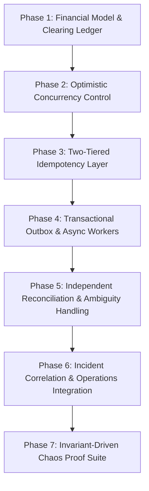

# 🛡️ BankVerse v2 — Architectural Evolution & Implementation Roadmap

> **Engineering Thesis**: _How do you maintain absolute financial correctness when payment providers, webhooks, network retries, and downstream systems fail or behave unpredictably?_

---

## 🎯 Architectural Principles & Goals

1. **Strict Financial Invariants**:
   - Double-entry ledger is strictly append-only and always balanced ($\sum \text{debits} \equiv \sum \text{credits}$).
   - Three-legged clearing booking model (_Customer $\rightarrow$ Clearing $\rightarrow$ Merchant_) prevents $DEBIT\_WITHOUT\_CREDIT$ anomalies.
2. **Concurrency & Idempotency Safety**:
   - Optimistic Concurrency Control (OCC) using entity versioning (`version`) guarantees atomic, single-winner state transitions.
   - Redis + Database uniqueness ensures duplicate API/webhook calls produce exactly 1 financial movement and return consistent cached results.
3. **Transactional Event Consistency**:
   - Transactional Outbox pattern guarantees atomic persistence of Payment State, Ledger Entries, and Outbox Events within a single database transaction.
4. **Resilient Eventual Settlement & Operations**:
   - Independent background reconciliation matches internal ledger records against external provider feeds.
   - Incident detection and correlation group related failure spikes into unified, actionable operational incidents.
5. **Verifiable Chaos Proof Layer**:
   - Chaos Lab scenarios validate system invariants under injected faults (race conditions, network timeouts, out-of-order webhooks, worker crashes).

---

## 🗺️ Implementation Phases



---

### Phase 1: Financial Model & Three-Legged Clearing Ledger

- **Goal**: Guarantee ledger double-entry balance under all success and failure conditions.
- **Key Changes**:
  - Implement three-legged booking:
    1. **After Capture Confirmed**: Debit Customer $\rightarrow$ Credit Clearing Suspense Account. (Ledger booking occurs only after confirmed provider capture).
    2. **Settlement**: Debit Clearing Suspense Account $\rightarrow$ Credit Merchant.
    3. **Failure/Reversal**: Debit Clearing Suspense Account $\rightarrow$ Credit Customer.
  - Enforce invariant: Merchant account is **never credited** until external capture is confirmed.
  - Re-label legacy $DEBIT\_WITHOUT\_CREDIT$ concept to $DEBIT\_WITHOUT\_MERCHANT\_SETTLEMENT$ to reflect balanced Clearing Account semantics.
- **Invariants Verified**:
  - $\sum \text{debits} - \sum \text{credits} = 0$ across all accounts at all times.
  - If BankVerse has already booked customer funds into Clearing and settlement subsequently fails, those funds remain in Clearing until an explicit reversal moves them back to the customer.

---

### Phase 2: Optimistic Concurrency Control (OCC)

- **Goal**: Prevent race conditions, double-settlements, and concurrent state corruption.
- **Key Changes**:
  - Add `version: number` attribute to `PaymentTransaction` and `LedgerAccount` schemas.
  - Enforce conditional updates on state transitions:
    ```sql
    UPDATE payments
    SET state = 'SUCCESS', version = version + 1
    WHERE id = ? AND state = 'PROCESSING' AND version = ?
    ```
- **Invariants Verified**:
  - Concurrent operations on the same transaction result in **1 winner** and $N-1$ safe OCC conflicts/retries.
  - Zero double-charges or double-refunds under parallel requests.

---

### Phase 3: Two-Tiered Idempotency Layer (Redis + DB)

- **Goal**: Prevent duplicate transaction processing while returning deterministic responses to clients.
- **Key Changes**:
  - **Tier 1 (Redis)**: Short-lived distributed lock (`SETNX` with TTL) on `Idempotency-Key` for fast duplicate rejection and result caching.
  - **Tier 2 (Database)**: Authoritative unique index constraint on `idempotencyKey` in `PaymentTransaction` table as the ultimate guard.
  - Return cached original transaction payload for repeated requests instead of generic error codes.
- **Invariants Verified**:
  - $N$ identical API requests with the same idempotency key produce **1 financial transaction** and $N$ identical safe responses.
  - Database unique index remains the absolute source of truth over Redis cache.

---

### Phase 4: Transactional Outbox & Async Worker Engine

- **Goal**: Decouple payment processing from external network calls without losing events or creating inconsistent states.
- **Key Changes**:
  - Create `outbox_events` schema (`id`, `aggregateId`, `eventType`, `payload`, `status`, `createdAt`, `version`).
  - Wrap Payment State + Ledger Entries + Outbox Event creation in a single atomic database transaction.
  - Implement async worker process to poll/consume outbox events, execute provider API calls, and emit downstream settlement events.
- **Invariants Verified**:
  - **At-Least-Once Delivery**: Worker crash after DB commit does not cause lost events.
  - **Idempotent Execution**: Worker retries do not duplicate ledger entries.

---

### Phase 5: Independent Reconciliation & Ambiguity Handling

- **Goal**: Verify internal financial truth independently against external provider settlement feeds.
- **Key Changes**:
  - Maintain independent settlement feed import rather than relying solely on internal outbox events.
  - Add explicit `AMBIGUOUS_MATCH` status for fuzzy matches with multiple plausible external candidates (e.g., identical amount, provider, and customer on the same day).
  - Escalate `AMBIGUOUS_MATCH` items to `ACTION_REQUIRED` for human/operator intervention.
- **Invariants Verified**:
  - Zero false-positive auto-reconciliations on ambiguous records.
  - Internal and external sources of truth remain strictly decoupled for independent verification.

---

### Phase 6: Incident Correlation & Operations Integration

- **Goal**: Aggregate systemic failure signals into single actionable incidents to eliminate alert fatigue.
- **Key Changes**:
  - Route `PAYMENT_UNKNOWN`, `RECONCILIATION_MISMATCH`, and provider error spikes into `IncidentDetector`.
  - Group events by `provider` + `method` + `errorType` over sliding 5-minute time windows via `IncidentCorrelator`.
  - Connect operations dashboard to trigger automated compensating ledger entries.
- **Invariants Verified**:
  - 1,000 failure events from a provider outage group into **1 correlated incident**.

---

### Phase 7: Invariant-Driven Chaos Proof Suite

- **Goal**: Automated test harness demonstrating all system invariants under fault injection.
- **Scenarios & Assertions**:
  1. **Concurrent Refund Race**: 100 simultaneous refunds $\rightarrow$ 1 refund succeeds, 99 OCC rejections.
  2. **Worker Crash & Recovery (`WORKER_CRASH_AFTER_COMMIT`)**: DB transaction commits $\rightarrow$ Worker process crashes $\rightarrow$ Process restarts $\rightarrow$ Outbox event recovered and processed without duplicate financial movement.
  3. **Duplicate Request Burst**: 10 parallel requests with same key $\rightarrow$ 1 financial movement, 10 identical safe responses.
  4. **Out-of-Order Webhooks**: `SUCCESS` followed by `PROCESSING` $\rightarrow$ Final state remains `SUCCESS`.
  5. **Provider Timeout Recovery**: Network timeout $\rightarrow$ `UNKNOWN` state $\rightarrow$ `getPaymentStatus()` status recovery $\rightarrow$ Settlement decision.
  6. **Clearing Settlement Failure**: Customer debited to Clearing $\rightarrow$ Settlement fails $\rightarrow$ Merchant uncredited, ledger balanced, incident created $\rightarrow$ Automated compensation.
  7. **Ambiguous Reconciliation**: Multiple plausible external candidates $\rightarrow$ `AMBIGUOUS_MATCH` status, zero auto-matches.

---

## ✅ Pre-Demo Verification Checklist

- [ ] **Phase 1 Invariants**: Every ledger entry operation satisfies $\sum \text{debits} - \sum \text{credits} = 0$. Merchant is never credited before capture.
- [ ] **Phase 2 Invariants**: 100 concurrent state transitions on the same transaction produce exactly 1 winner and 99 OCC conflict rejections.
- [ ] **Phase 3 Invariants**: 10 duplicate payment requests produce exactly 1 financial movement and 10 safe responses. Database unique index serves as ultimate guard.
- [ ] **Phase 4 Invariants**: Simulating a worker crash after DB commit recovers the outbox event upon restart without duplicate financial movements.
- [ ] **Phase 5 Invariants**: Multi-candidate reconciliation records resolve to `AMBIGUOUS_MATCH` without auto-matching.
- [ ] **Phase 6 Invariants**: 1,000 failure events during a provider outage merge into 1 correlated incident on the Operations Dashboard.
- [ ] **Phase 7 Invariants**: Every Chaos Lab scenario run preserves global double-entry ledger balance.

---

## 🏛️ Target Architecture Overview

```
                         CLIENT
                           │
                           ▼
                   API / Payment Command
                           │
                           ▼
                  ┌─────────────────┐
                  │ Idempotency     │
                  │ Redis + DB      │
                  └────────┬────────┘
                           │
                           ▼
                  ┌─────────────────────┐
                  │ AUTHORITATIVE DB    │
                  │                     │
                  │ Payment + OCC       │
                  │ Ledger              │
                  │ Clearing Account    │
                  │ Outbox              │
                  └──────────┬──────────┘
                             │
                      ATOMIC COMMIT
                             │
                             ▼
                        OUTBOX TABLE
                             │
                             ▼
                     ASYNC EVENT WORKER
                       │         │
                       ▼         ▼
                   Provider   Other consumers
                       │
                  ┌────┴────┐
                  ▼         ▼
               SUCCESS    UNKNOWN
                  │         │
                  │      Status Query
                  │         │
                  └────┬────┘
                       ▼
                  SETTLEMENT
                       │
                       ▼
              PROVIDER SETTLEMENT FEED
                       │
                       ▼
                RECONCILIATION
                       │
             ┌─────────┴─────────┐
             ▼                   ▼
          MATCHED            MISMATCH / AMBIGUOUS
                                 │
                                 ▼
                         INCIDENT DETECTOR
                                 │
                                 ▼
                         INCIDENT CORRELATOR
                                 │
                                 ▼
                         OPERATIONS / RECOVERY
```

---

## 🛠️ Verification & Testing Strategy

BankVerse verification checks are exposed through development test endpoints and a CLI runner (`npm test`):
- `/api/test-ledger` — Phase 1 double-entry ledger & balance assertions
- `/api/test-payment` — Phase 2 dual-dimension state machine & 100 concurrent OCC race test
- `/api/test-reconciliation` — Phase 3 internal/external matching & ambiguity detection
- `/api/test-chaos` — Phase 4 fault injection & financial invariant assertions
- `/api/test-operations` — Phase 5 incident detection, correlation & operations metrics
- `/api/test-debit-without-credit` — End-to-end recovery lifecycle verification

