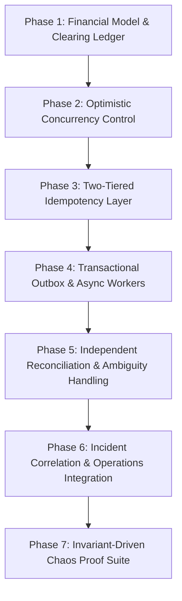

# 🛡️ BankVerse v2 — Architectural Evolution & Implementation Roadmap

> **Engineering Thesis**: _How do you maintain absolute financial correctness when payment providers, webhooks, network retries, and downstream systems fail or behave unpredictably?_

---

## 🎯 Architectural Principles & Goals

1. **Strict Financial Invariants**:
   - Double-entry ledger is strictly append-only and always balanced ($\sum \text{debits} \equiv \sum \text{credits}$).
   - Three-legged clearing booking model (_Customer $\rightarrow$ Clearing $\rightarrow$ Merchant_) prevents $DEBIT\_WITHOUT\_CREDIT$ anomalies.
2. **Concurrency & Idempotency Safety**:
   - Optimistic Concurrency Control (OCC) using entity versioning (`version`) guarantees atomic, single-winner state transitions.
   - Redis + Database uniqueness ensures duplicate API/webhook calls produce exactly 1 financial movement and return consistent cached results.
3. **Transactional Event Consistency**:
   - Transactional Outbox pattern guarantees atomic persistence of Payment State, Ledger Entries, and Outbox Events within a single database transaction.
4. **Resilient Eventual Settlement & Operations**:
   - Independent background reconciliation matches internal ledger records against external provider feeds.
   - Incident detection and correlation group related failure spikes into unified, actionable operational incidents.
5. **Verifiable Chaos Proof Layer**:
   - Chaos Lab scenarios validate system invariants under injected faults (race conditions, network timeouts, out-of-order webhooks, worker crashes).

---

## 🗺️ Implementation Phases



---

### Phase 1: Financial Model & Three-Legged Clearing Ledger

- **Goal**: Guarantee ledger double-entry balance under all success and failure conditions.
- **Key Changes**:
  - Implement three-legged booking:
    1. **After Capture Confirmed**: Debit Customer $\rightarrow$ Credit Clearing Suspense Account. (Ledger booking occurs only after confirmed provider capture).
    2. **Settlement**: Debit Clearing Suspense Account $\rightarrow$ Credit Merchant.
    3. **Failure/Reversal**: Debit Clearing Suspense Account $\rightarrow$ Credit Customer.
  - Enforce invariant: Merchant account is **never credited** until external capture is confirmed.
  - Re-label legacy $DEBIT\_WITHOUT\_CREDIT$ concept to $DEBIT\_WITHOUT\_MERCHANT\_SETTLEMENT$ to reflect balanced Clearing Account semantics.
- **Invariants Verified**:
  - $\sum \text{debits} - \sum \text{credits} = 0$ across all accounts at all times.
  - If BankVerse has already booked customer funds into Clearing and settlement subsequently fails, those funds remain in Clearing until an explicit reversal moves them back to the customer.

---

### Phase 2: Optimistic Concurrency Control (OCC)

- **Goal**: Prevent race conditions, double-settlements, and concurrent state corruption.
- **Status**: ✅ Demo complete — OCC version checks, race tests, and rollback behavior are implemented and verified. Production deployment still requires an atomic database conditional-write adapter.
- **Key Changes**:
  - Add `version: number` attribute to `PaymentTransaction` and `LedgerAccount` schemas.
  - Enforce conditional updates on state transitions:
    ```sql
    UPDATE payments
    SET state = 'SUCCESS', version = version + 1
    WHERE id = ? AND state = 'PROCESSING' AND version = ?
    ```
  - **Removed `runWithEntityLock()` from all OCC-critical paths** (`updatePaymentTransactionState`, `updateAccountAggregates`, `recordTransaction`, `processPayment`). The version check is now the **sole** concurrency guard.
  - Added **post-create idempotency check** in `recordTransaction()`: if two callers race past the pre-check, the second discovers the first's transaction and returns it.
- **Known Limitation**: Appwrite's `getDocument() → check version → updateDocument()` is check-then-update, not atomic conditional UPDATE. In demo mode (single Node.js process), the synchronous check-and-update is effectively atomic. For true distributed OCC, a database with atomic conditional writes (PostgreSQL `UPDATE ... WHERE version = $expected`) is required. This is the Phase 2 completion gate.
- **Invariants Verified**:
  - Concurrent operations on the same transaction result in **1 winner** and $N-1$ safe OCC conflicts/retries.
  - Zero double-charges or double-refunds under parallel requests.
  - **Test 11**: 100 concurrent financial settlement attempts → 1 winner, 99 OCC conflicts, exactly 2 settlement entries, exactly 4 total ledger entries.

---

### Phase 3: Two-Tiered Idempotency Layer (Redis + DB)

- **Goal**: Prevent duplicate transaction processing while returning deterministic responses to clients.
- **Key Changes**:
  - **Tier 1 (Redis)**: Short-lived distributed lock (`SETNX` with TTL) on `Idempotency-Key` for fast duplicate rejection and result caching.
  - **Tier 2 (Database)**: Authoritative unique index constraint on `idempotencyKey` in `PaymentTransaction` table as the ultimate guard.
  - Return cached original transaction payload for repeated requests instead of generic error codes.
- **Invariants Verified**:
  - $N$ identical API requests with the same idempotency key produce **1 financial transaction** and $N$ identical safe responses.
  - Database unique index remains the absolute source of truth over Redis cache.

---

### Phase 4: Transactional Outbox & Async Worker Engine

- **Goal**: Decouple payment processing from external network calls without losing events or creating inconsistent states.
- **Key Changes**:
  - Create `outbox_events` schema (`id`, `aggregateId`, `eventType`, `payload`, `status`, `createdAt`, `version`).
  - Wrap Payment State + Ledger Entries + Outbox Event creation in a single atomic database transaction.
  - Implement async worker process to poll/consume outbox events, execute provider API calls, and emit downstream settlement events.
- **Invariants Verified**:
  - **At-Least-Once Delivery**: Worker crash after DB commit does not cause lost events.
  - **Idempotent Execution**: Worker retries do not duplicate ledger entries.

---

### Phase 5: Independent Reconciliation & Ambiguity Handling

- **Goal**: Verify internal financial truth independently against external provider settlement feeds.
- **Key Changes**:
  - Maintain independent settlement feed import rather than relying solely on internal outbox events.
  - Add explicit `AMBIGUOUS_MATCH` status for fuzzy matches with multiple plausible external candidates (e.g., identical amount, provider, and customer on the same day).
  - Escalate `AMBIGUOUS_MATCH` items to `ACTION_REQUIRED` for human/operator intervention.
- **Invariants Verified**:
  - Zero false-positive auto-reconciliations on ambiguous records.
  - Internal and external sources of truth remain strictly decoupled for independent verification.

---

### Phase 6: Incident Correlation & Operations Integration

- **Goal**: Aggregate systemic failure signals into single actionable incidents to eliminate alert fatigue.
- **Key Changes**:
  - Route `PAYMENT_UNKNOWN`, `RECONCILIATION_MISMATCH`, and provider error spikes into `IncidentDetector`.
  - Group events by `provider` + `method` + `errorType` over sliding 5-minute time windows via `IncidentCorrelator`.
  - Connect operations dashboard to trigger automated compensating ledger entries.
- **Invariants Verified**:
  - 1,000 failure events from a provider outage group into **1 correlated incident**.

---

### Phase 7: Invariant-Driven Chaos Proof Suite

- **Goal**: Automated test harness demonstrating all system invariants under fault injection.
- **Scenarios & Assertions**:
  1. **Concurrent Refund Race**: 100 simultaneous refunds $\rightarrow$ 1 refund succeeds, 99 OCC rejections.
  2. **Worker Crash & Recovery (`WORKER_CRASH_AFTER_COMMIT`)**: DB transaction commits $\rightarrow$ Worker process crashes $\rightarrow$ Process restarts $\rightarrow$ Outbox event recovered and processed without duplicate financial movement.
  3. **Duplicate Request Burst**: 10 parallel requests with same key $\rightarrow$ 1 financial movement, 10 identical safe responses.
  4. **Out-of-Order Webhooks**: `SUCCESS` followed by `PROCESSING` $\rightarrow$ Final state remains `SUCCESS`.
  5. **Provider Timeout Recovery**: Network timeout $\rightarrow$ `UNKNOWN` state $\rightarrow$ `getPaymentStatus()` status recovery $\rightarrow$ Settlement decision.
  6. **Clearing Settlement Failure**: Customer debited to Clearing $\rightarrow$ Settlement fails $\rightarrow$ Merchant uncredited, ledger balanced, incident created $\rightarrow$ Automated compensation.
  7. **Ambiguous Reconciliation**: Multiple plausible external candidates $\rightarrow$ `AMBIGUOUS_MATCH` status, zero auto-matches.

---

## ✅ Pre-Demo Verification Checklist

- [x] **Phase 1 Invariants**: Every ledger entry operation satisfies $\sum \text{debits} - \sum \text{credits} = 0$. Merchant is never credited before capture.
- [x] **Phase 2 Invariants**: 100 concurrent state transitions on the same transaction produce exactly 1 winner and 99 OCC conflict rejections.
- [x] **Phase 3 Invariants**: 10 duplicate payment requests produce exactly 1 financial movement and 10 safe responses. Database uniqueness is represented by the authoritative repository contract.
- [x] **Phase 4 Invariants**: Simulating a worker crash after DB commit recovers the outbox event upon restart without duplicate financial movements.
- [x] **Phase 5 Invariants**: Multi-candidate reconciliation records resolve to `AMBIGUOUS_MATCH` without auto-matching.
- [x] **Phase 6 Invariants**: Correlated provider failure events merge into one incident on the Operations Dashboard.
- [x] **Phase 7 Invariants**: Every Chaos Lab scenario run preserves global double-entry ledger balance.

**Production gates remaining**: the default demo adapter is process-local in-memory storage. Before production use, replace it with a transactional database adapter, enforce database unique constraints for idempotency, use an atomic conditional `UPDATE ... WHERE version = expectedVersion`, and connect the outbox to a durable worker queue. These are deployment prerequisites, not unverified application behavior.

---

## 🏛️ Target Architecture Overview

```
                         CLIENT
                           │
                           ▼
                   API / Payment Command
                           │
                           ▼
                  ┌─────────────────┐
                  │ Idempotency     │
                  │ Redis + DB      │
                  └────────┬────────┘
                           │
                           ▼
                  ┌─────────────────────┐
                  │ AUTHORITATIVE DB    │
                  │                     │
                  │ Payment + OCC       │
                  │ Ledger              │
                  │ Clearing Account    │
                  │ Outbox              │
                  └──────────┬──────────┘
                             │
                      ATOMIC COMMIT
                             │
                             ▼
                        OUTBOX TABLE
                             │
                             ▼
                     ASYNC EVENT WORKER
                       │         │
                       ▼         ▼
                   Provider   Other consumers
                       │
                  ┌────┴────┐
                  ▼         ▼
               SUCCESS    UNKNOWN
                  │         │
                  │      Status Query
                  │         │
                  └────┬────┘
                       ▼
                  SETTLEMENT
                       │
                       ▼
              PROVIDER SETTLEMENT FEED
                       │
                       ▼
                RECONCILIATION
                       │
             ┌─────────┴─────────┐
             ▼                   ▼
          MATCHED            MISMATCH / AMBIGUOUS
                                 │
                                 ▼
                         INCIDENT DETECTOR
                                 │
                                 ▼
                         INCIDENT CORRELATOR
                                 │
                                 ▼
                         OPERATIONS / RECOVERY
```

---

## 🛠️ Verification & Testing Strategy

BankVerse verification checks are exposed through development test endpoints and a CLI runner (`npm test`):

- `/api/test-ledger` — Phase 1 double-entry ledger & balance assertions
- `/api/test-payment` — Phase 2 dual-dimension state machine & 100 concurrent OCC race test
- `/api/test-reconciliation` — Phase 3 internal/external matching & ambiguity detection
- `/api/test-chaos` — Phase 4 fault injection & financial invariant assertions
- `/api/test-operations` — Phase 5 incident detection, correlation & operations metrics
- `/api/test-debit-without-credit` — End-to-end recovery lifecycle verification
- `/api/test-npci-settlement` — NPCI settlement parsing and reconciliation verification
- `/api/test-credit` — UPI credit line lifecycle verification
- `/api/test-risk` — seeded risk dataset, causal features, detector, and metric verification

---

## AI Risk Manager Hackathon Track

### Goal

Add a defense-only fraud-spike detector that helps merchants reduce fraud loss without claiming that synthetic evaluation equals production performance. The detector will produce reproducible precision, recall, F1, false-positive rate, and expected rupee cost on a held-out test set.

### Phase 1: Risk Data Foundation

- Add `lib/risk/types.ts` for transactions, feature vectors, risk scores, labels, and evaluation reports.
- Add `lib/risk/dataset.ts` with a seeded generator for India-realistic UPI transactions and four labeled patterns: card-testing bursts, coordinated velocity rings, night high-value anomalies, and refund abuse.
- Add a stratified 70/30 train/test split with deterministic output and no label leakage.
- Verify generator determinism, class counts, split integrity, and valid timestamps/amounts.

### Phase 2: Feature Engineering

- Add `lib/risk/features.ts` for causal sliding-window velocity, merchant novelty, night activity, amount deviation, refund ratio, and device sharing features.
- Ensure each feature only uses transactions earlier than the transaction being scored.
- Verify feature calculations against small hand-built fixtures.

### Phase 3: Explainable Detector

- Add pure TypeScript logistic regression with L2 regularization and inspectable weights.
- Add explicit defense-only rules for card-testing bursts, velocity caps, and night high-value activity.
- Combine model probability and rules into an explained `ALLOW`, `REVIEW`, or `BLOCK` score.

### Phase 4: Honest Evaluation

- Add confusion matrices, precision, recall, F1, false-positive rate, PR curve points, and threshold evaluation.
- Add a configurable cost model: false negatives use estimated fraud exposure; false positives use manual review and customer-friction cost.
- Select and display the cost-optimal threshold without hiding the tradeoff.

### Phase 5: Abuse-Ring Detection

- Group shared-device and coordinated merchant activity into explainable fraud-ring records.
- Include members, merchants, timeline, and exposure, without exposing or generating offensive capabilities.

### Phase 6: Risk APIs and Verification

- Add `/api/risk/evaluate`, `/api/risk/score`, `/api/risk/rings`, `/api/risk/threshold`, and `/api/test-risk`.
- Extend `scripts/run-tests.mjs` with the risk verification phase.
- The verification endpoint must assert seeded reproducibility, split integrity, metric calculation, and configured quality bars.

### Phase 7: Risk Command Center

- Add a `/risk-center` page with evaluation metrics, confusion matrix, threshold/cost tuning, live explained scoring, and abuse-ring timelines.
- Add the page to the desktop and mobile navigation using existing UI conventions.

### Phase 8: Documentation and Release

- Add a hackathon pitch document with data-generation disclosure, exact measured metrics, false-positive cost assumptions, limitations, and defense-only scope.
- Run the focused risk checks after every phase, then `npm test`, `npm run lint`, and `npm run build`.
- Commit the completed work and push the current branch to the configured `origin` remote only after all checks pass.
