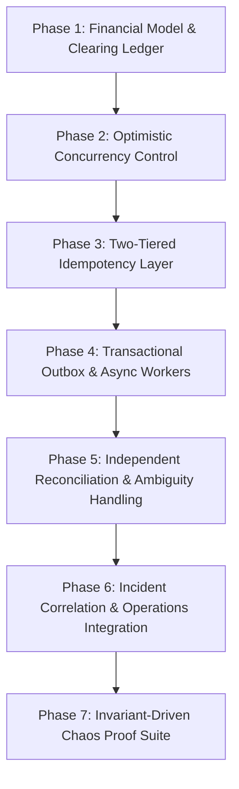
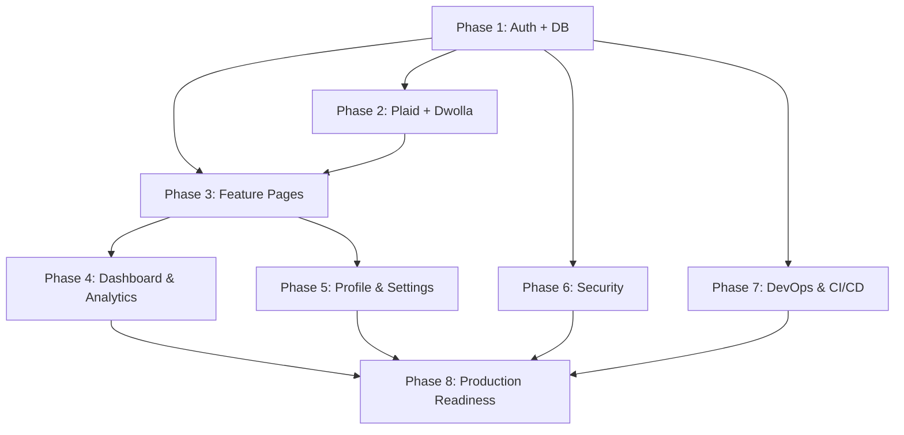

# 🛡️ BankVerse v2 — Architectural Evolution & Implementation Roadmap

> **Engineering Thesis**: _How do you maintain absolute financial correctness when payment providers, webhooks, network retries, and downstream systems fail or behave unpredictably?_

---

## 🎯 Architectural Principles & Goals

1. **Strict Financial Invariants**:
   - Double-entry ledger is strictly append-only and always balanced ($\sum \text{debits} \equiv \sum \text{credits}$).
   - Three-legged clearing booking model (_Customer $\rightarrow$ Clearing $\rightarrow$ Merchant_) prevents $DEBIT\_WITHOUT\_CREDIT$ anomalies.
2. **Concurrency & Idempotency Safety**:
   - Optimistic Concurrency Control (OCC) using entity versioning (`version`) guarantees atomic, single-winner state transitions.
   - Redis + Database uniqueness ensures duplicate API/webhook calls produce exactly 1 financial movement and return consistent cached results.
3. **Transactional Event Consistency**:
   - Transactional Outbox pattern guarantees atomic persistence of Payment State, Ledger Entries, and Outbox Events within a single database transaction.
4. **Resilient Eventual Settlement & Operations**:
   - Independent background reconciliation matches internal ledger records against external provider feeds.
   - Incident detection and correlation group related failure spikes into unified, actionable operational incidents.
5. **Verifiable Chaos Proof Layer**:
   - Chaos Lab scenarios validate system invariants under injected faults (race conditions, network timeouts, out-of-order webhooks, worker crashes).

---

## 🗺️ Implementation Phases



---

### Phase 1: Financial Model & Three-Legged Clearing Ledger

- **Goal**: Guarantee ledger double-entry balance under all success and failure conditions.
- **Key Changes**:
  - Implement three-legged booking:
    1. **Authorization/Capture**: Debit Customer $\rightarrow$ Credit Clearing Suspense Account.
    2. **Settlement**: Debit Clearing Suspense Account $\rightarrow$ Credit Merchant.
    3. **Failure/Reversal**: Debit Clearing Suspense Account $\rightarrow$ Credit Customer.
  - Enforce invariant: Merchant account is **never credited** until external capture is confirmed.
  - Re-label legacy $DEBIT\_WITHOUT\_CREDIT$ concept to $DEBIT\_WITHOUT\_MERCHANT\_SETTLEMENT$ to reflect balanced Clearing Account semantics.
- **Invariants Verified**:
  - $\sum \text{debits} - \sum \text{credits} = 0$ across all accounts at all times.
  - Incomplete/failed transactions leave customer funds in Clearing before automated reversal.

---

### Phase 2: Optimistic Concurrency Control (OCC)

- **Goal**: Prevent race conditions, double-settlements, and concurrent state corruption.
- **Key Changes**:
  - Add `version: number` attribute to `PaymentTransaction` and `LedgerAccount` schemas.
  - Enforce conditional updates on state transitions:
    ```sql
    UPDATE payments
    SET state = 'SUCCESS', version = version + 1
    WHERE id = ? AND state = 'PROCESSING' AND version = ?
    ```
- **Invariants Verified**:
  - Concurrent operations on the same transaction result in **1 winner** and $N-1$ safe OCC conflicts/retries.
  - Zero double-charges or double-refunds under parallel requests.

---

### Phase 3: Two-Tiered Idempotency Layer (Redis + DB)

- **Goal**: Prevent duplicate transaction processing while returning deterministic responses to clients.
- **Key Changes**:
  - **Tier 1 (Redis)**: Short-lived distributed lock (`SETNX` with TTL) on `Idempotency-Key` for fast duplicate rejection and result caching.
  - **Tier 2 (Database)**: Authoritative unique index constraint on `idempotencyKey` in `PaymentTransaction` table as the ultimate guard.
  - Return cached original transaction payload for repeated requests instead of generic error codes.
- **Invariants Verified**:
  - $N$ identical API requests with the same idempotency key produce **1 financial transaction** and $N$ identical safe responses.
  - Database unique index remains the absolute source of truth over Redis cache.

---

### Phase 4: Transactional Outbox & Async Worker Engine

- **Goal**: Decouple payment processing from external network calls without losing events or creating inconsistent states.
- **Key Changes**:
  - Create `outbox_events` schema (`id`, `aggregateId`, `eventType`, `payload`, `status`, `createdAt`, `version`).
  - Wrap Payment State + Ledger Entries + Outbox Event creation in a single atomic database transaction.
  - Implement async worker process to poll/consume outbox events, execute provider API calls, and emit downstream settlement events.
- **Invariants Verified**:
  - **At-Least-Once Delivery**: Worker crash after DB commit does not cause lost events.
  - **Idempotent Execution**: Worker retries do not duplicate ledger entries.

---

### Phase 5: Independent Reconciliation & Ambiguity Handling

- **Goal**: Verify internal financial truth independently against external provider settlement feeds.
- **Key Changes**:
  - Maintain independent settlement feed import rather than relying solely on internal outbox events.
  - Add explicit `AMBIGUOUS_MATCH` status for fuzzy matches with multiple plausible external candidates (e.g., identical amount, provider, and customer on the same day).
  - Escalate `AMBIGUOUS_MATCH` items to `ACTION_REQUIRED` for human/operator intervention.
- **Invariants Verified**:
  - Zero false-positive auto-reconciliations on ambiguous records.
  - Internal and external sources of truth remain strictly decoupled for independent verification.

---

### Phase 6: Incident Correlation & Operations Integration

- **Goal**: Aggregate systemic failure signals into single actionable incidents to eliminate alert fatigue.
- **Key Changes**:
  - Route `PAYMENT_UNKNOWN`, `RECONCILIATION_MISMATCH`, and provider error spikes into `IncidentDetector`.
  - Group events by `provider` + `method` + `errorType` over sliding 5-minute time windows via `IncidentCorrelator`.
  - Connect operations dashboard to trigger automated compensating ledger entries.
- **Invariants Verified**:
  - 1,000 failure events from a provider outage group into **1 correlated incident**.

---

### Phase 7: Invariant-Driven Chaos Proof Suite

- **Goal**: Automated test harness demonstrating all system invariants under fault injection.
- **Scenarios & Assertions**:
  1. **Concurrent Refund Race**: 100 simultaneous refunds $\rightarrow$ 1 refund succeeds, 99 OCC rejections.
  2. **Worker Crash & Recovery (`WORKER_CRASH_AFTER_COMMIT`)**: DB transaction commits $\rightarrow$ Worker process crashes $\rightarrow$ Process restarts $\rightarrow$ Outbox event recovered and processed without duplicate financial movement.
  3. **Duplicate Request Burst**: 10 parallel requests with same key $\rightarrow$ 1 financial movement, 10 identical safe responses.
  4. **Out-of-Order Webhooks**: `SUCCESS` followed by `PROCESSING` $\rightarrow$ Final state remains `SUCCESS`.
  5. **Provider Timeout Recovery**: Network timeout $\rightarrow$ `UNKNOWN` state $\rightarrow$ `getPaymentStatus()` status recovery $\rightarrow$ Settlement decision.
  6. **Clearing Settlement Failure**: Customer debited to Clearing $\rightarrow$ Settlement fails $\rightarrow$ Merchant uncredited, ledger balanced, incident created $\rightarrow$ Automated compensation.
  7. **Ambiguous Reconciliation**: Multiple plausible external candidates $\rightarrow$ `AMBIGUOUS_MATCH` status, zero auto-matches.

---

## ✅ Pre-Demo Verification Checklist

- [ ] **Phase 1 Invariants**: Every ledger entry operation satisfies $\sum \text{debits} - \sum \text{credits} = 0$. Merchant is never credited before capture.
- [ ] **Phase 2 Invariants**: 100 concurrent state transitions on the same transaction produce exactly 1 winner and 99 OCC conflict rejections.
- [ ] **Phase 3 Invariants**: 10 duplicate payment requests produce exactly 1 financial movement and 10 safe responses. Database unique index serves as ultimate guard.
- [ ] **Phase 4 Invariants**: Simulating a worker crash after DB commit recovers the outbox event upon restart without duplicate financial movements.
- [ ] **Phase 5 Invariants**: Multi-candidate reconciliation records resolve to `AMBIGUOUS_MATCH` without auto-matching.
- [ ] **Phase 6 Invariants**: 1,000 failure events during a provider outage merge into 1 correlated incident on the Operations Dashboard.
- [ ] **Phase 7 Invariants**: Every Chaos Lab scenario run preserves global double-entry ledger balance.

---

## 🏛️ Target Architecture Overview

```
                         CLIENT
                           │
                           ▼
                   API / Payment Command
                           │
                           ▼
                  ┌─────────────────┐
                  │ Idempotency     │
                  │ Redis + DB      │
                  └────────┬────────┘
                           │
                           ▼
                  ┌─────────────────────┐
                  │ AUTHORITATIVE DB    │
                  │                     │
                  │ Payment + OCC       │
                  │ Ledger              │
                  │ Clearing Account    │
                  │ Outbox              │
                  └──────────┬──────────┘
                             │
                      ATOMIC COMMIT
                             │
                             ▼
                        OUTBOX TABLE
                             │
                             ▼
                     ASYNC EVENT WORKER
                       │         │
                       ▼         ▼
                   Provider   Other consumers
                       │
                  ┌────┴────┐
                  ▼         ▼
               SUCCESS    UNKNOWN
                  │         │
                  │      Status Query
                  │         │
                  └────┬────┘
                       ▼
                  SETTLEMENT
                       │
                       ▼
              PROVIDER SETTLEMENT FEED
                       │
                       ▼
                RECONCILIATION
                       │
             ┌─────────┴─────────┐
             ▼                   ▼
          MATCHED            MISMATCH / AMBIGUOUS
                                 │
                                 ▼
                         INCIDENT DETECTOR
                                 │
                                 ▼
                         INCIDENT CORRELATOR
                                 │
                                 ▼
                         OPERATIONS / RECOVERY
```

NEXT_PUBLIC_APPWRITE_PROJECT_ID=xxx
NEXT_PUBLIC_APPWRITE_DATABASE_ID=xxx
APPWRITE_API_KEY=xxx

```

### 1.2 Appwrite SDK Integration

- [ ] Install `node-appwrite` package
- [ ] Create `lib/appwrite/config.ts` — Appwrite client initialization (server + client)
- [ ] Create `lib/appwrite/auth.ts` — session helpers, `getLoggedInUser()`, `createSession()`, `deleteSession()`
- [ ] Create `lib/appwrite/db.ts` — CRUD helpers for all collections

### 1.3 Real Authentication

- [ ] Rewrite `lib/actions/user.actions.ts`:
- `signUp()` — create Appwrite account + user document in DB
- `signIn()` — create Appwrite email/password session
- `signOut()` — delete current session
- `getCurrentUser()` — fetch logged-in user from session
- [ ] Add Next.js middleware (`middleware.ts`) to protect `(root)` routes
- [ ] Redirect unauthenticated users to `/sign-in`
- [ ] Replace mock `loggedIn` in `(root)/layout.tsx` with real `getCurrentUser()`
- [ ] Add loading states and error handling to auth flow

### 1.4 Testing — Phase 1

- [ ] Unit tests for `user.actions.ts` (mocked Appwrite SDK)
- [ ] Integration test: sign-up → sign-in → protected route access → sign-out
- [ ] Test middleware redirect behavior

---

## Phase 2 — Plaid + Dwolla Integration

### 2.1 Plaid Link

- [ ] Install `plaid` npm package
- [ ] Create Plaid developer account, get sandbox keys
- [ ] Add to `.env.local`:
```

PLAID_CLIENT_ID=xxx
PLAID_SECRET=sandbox-xxx
PLAID_ENV=sandbox

```
- [ ] Create `lib/plaid/config.ts` — Plaid client setup
- [ ] Create `lib/actions/plaid.actions.ts`:
- `createLinkToken()` — generate Plaid Link token for a user
- `exchangePublicToken()` — exchange public token for access token
- `getAccounts()` — fetch accounts from Plaid
- `getTransactions()` — fetch transactions from Plaid
- `getAccountBalances()` — fetch real-time balances
- [ ] Build `<PlaidLink />` component (replace `{/* plaid link */}` in AuthForm)
- [ ] Store Plaid `accessToken` and `itemId` in Appwrite `banks` collection

### 2.2 Dwolla Integration

- [ ] Create Dwolla sandbox account
- [ ] Add to `.env.local`:
```

DWOLLA_KEY=xxx
DWOLLA_SECRET=xxx
DWOLLA_ENV=sandbox

````
- [ ] Create `lib/dwolla/config.ts` — Dwolla client
- [ ] Create `lib/actions/dwolla.actions.ts`:
- `createDwollaCustomer()` — create Dwolla customer for new users
- `createFundingSource()` — link Plaid processor token to Dwolla
- `createTransfer()` — initiate ACH transfer
- `getTransferStatus()` — check transfer status

### 2.3 Testing — Phase 2

- [ ] Unit tests for Plaid actions (mocked Plaid SDK)
- [ ] Unit tests for Dwolla actions (mocked Dwolla SDK)
- [ ] Integration test: Plaid Link flow → exchange token → fetch accounts
- [ ] Integration test: Dwolla transfer flow end-to-end

---

## Phase 3 — Feature Pages

### 3.1 My Banks Page (`/my-banks`)

- [ ] Fetch user's connected banks from Appwrite
- [ ] Display bank cards with real data (balance, mask, institution)
- [ ] Add "Connect New Bank" button → triggers Plaid Link
- [ ] Add "Disconnect Bank" with confirmation dialog
- [ ] Show account type badges (checking, savings, credit)

### 3.2 Transaction History Page (`/transaction-history`)

- [ ] Fetch paginated transactions from Appwrite/Plaid
- [ ] Build `<TransactionsTable />` component with columns:
- Name, Amount, Date, Category, Status, Channel
- [ ] Add pagination controls (`<Pagination />`)
- [ ] Add filters: date range, category, account, search by name
- [ ] Add sort by: date, amount, name
- [ ] Export transactions as CSV

### 3.3 Payment Transfer Page (`/payment-transfer`)

- [ ] Build transfer form with:
- Source account dropdown (user's banks)
- Destination: own account OR external (email/routing number)
- Amount input with validation
- Transfer note/description
- [ ] Show real-time balance after source account selection
- [ ] Transfer confirmation step with summary
- [ ] Success page with transaction receipt
- [ ] Transfer history within the page

### 3.4 Testing — Phase 3

- [ ] Component tests for `<TransactionsTable />`, `<Pagination />`
- [ ] E2E test: navigate to My Banks → view accounts
- [ ] E2E test: navigate to Transaction History → filter → paginate
- [ ] E2E test: complete a transfer flow

---

## Phase 4 — Dashboard & Analytics

### 4.1 Homepage Dashboard

- [ ] Replace `RECENT TRANSACTIONS` placeholder with real `<RecentTransactions />` component
- [ ] Show last 5 transactions with click-to-expand detail
- [ ] Add "View All" link to transaction history

### 4.2 Charts & Analytics

- [ ] Spending by category — doughnut chart (already have `<DoughnutChart />`)
- [ ] Monthly income vs expenses — line/bar chart
- [ ] Net worth over time — area chart
- [ ] Top spending categories breakdown

### 4.3 Testing — Phase 4

- [ ] Component tests for chart components
- [ ] Visual regression tests for dashboard layout

---

## Phase 5 — User Profile & Settings

### 5.1 Profile Page (`/profile`)

- [ ] Display and edit user info (name, email, address)
- [ ] Change password flow
- [ ] Profile picture upload

### 5.2 Notifications

- [ ] Email notifications for: large transactions, low balance, transfer complete
- [ ] In-app notification bell with dropdown

### 5.3 Testing — Phase 5

- [ ] Unit tests for profile update actions
- [ ] E2E test: update profile → verify changes persist

---

## Phase 6 — Security Hardening

### 6.1 Authentication Security

- [ ] Rate limiting on sign-in attempts (3 failures → 5 min lockout)
- [ ] Add CAPTCHA to sign-up form
- [ ] Session timeout after inactivity (30 min)
- [ ] Force HTTPS in production

### 6.2 Data Security

- [ ] Input sanitization on all forms (zod schemas already in place — audit them)
- [ ] CSRF tokens on state-changing requests
- [ ] Encrypt sensitive data at rest (SSN, bank tokens)
- [ ] Audit logging for sensitive operations

### 6.3 Testing — Phase 6

- [ ] Security scan with `npm audit`
- [ ] OWASP ZAP scan on staging
- [ ] Penetration test checklist

---

## Phase 7 — DevOps & CI/CD

### 7.1 Docker

- [ ] Create `Dockerfile` (multi-stage build):

```dockerfile
# Stage 1: Dependencies
FROM node:20-alpine AS deps
WORKDIR /app
COPY package.json package-lock.json ./
RUN npm ci --only=production

# Stage 2: Build
FROM node:20-alpine AS builder
WORKDIR /app
COPY --from=deps /app/node_modules ./node_modules
COPY . .
RUN npm run build

# Stage 3: Production
FROM node:20-alpine AS runner
WORKDIR /app
ENV NODE_ENV=production
COPY --from=builder /app/.next/standalone ./
COPY --from=builder /app/.next/static ./.next/static
COPY --from=builder /app/public ./public
EXPOSE 3000
CMD ["node", "server.js"]
````

- [ ] Create `docker-compose.yml` for local dev with Appwrite
- [ ] Add `.dockerignore`

### 7.2 GitHub Actions CI/CD Pipeline

- [ ] Create `.github/workflows/ci.yml`:

  ```yaml
  name: CI Pipeline
  on:
    push:
      branches: [main, develop]
    pull_request:
      branches: [main]

  jobs:
    lint:
      runs-on: ubuntu-latest
      steps:
        - uses: actions/checkout@v4
        - uses: actions/setup-node@v4
          with: { node-version: "20", cache: "npm" }
        - run: npm ci
        - run: npm run lint

    type-check:
      runs-on: ubuntu-latest
      steps:
        - uses: actions/checkout@v4
        - uses: actions/setup-node@v4
          with: { node-version: "20", cache: "npm" }
        - run: npm ci
        - run: npx tsc --noEmit

    test:
      runs-on: ubuntu-latest
      steps:
        - uses: actions/checkout@v4
        - uses: actions/setup-node@v4
          with: { node-version: "20", cache: "npm" }
        - run: npm ci
        - run: npm test -- --coverage
        - uses: actions/upload-artifact@v4
          with:
            name: coverage
            path: coverage/

    build:
      needs: [lint, type-check, test]
      runs-on: ubuntu-latest
      steps:
        - uses: actions/checkout@v4
        - uses: actions/setup-node@v4
          with: { node-version: "20", cache: "npm" }
        - run: npm ci
        - run: npm run build

    docker:
      needs: [build]
      runs-on: ubuntu-latest
      steps:
        - uses: actions/checkout@v4
        - uses: docker/build-push-action@v5
          with:
            context: .
            push: false
            tags: bankverse:latest
  ```

- [ ] Create `.github/workflows/deploy.yml`:

  ```yaml
  name: Deploy to Vercel
  on:
    push:
      branches: [main]

  jobs:
    deploy:
      runs-on: ubuntu-latest
      steps:
        - uses: actions/checkout@v4
        - uses: amondnet/vercel-action@v25
          with:
            vercel-token: ${{ secrets.VERCEL_TOKEN }}
            vercel-org-id: ${{ secrets.VERCEL_ORG_ID }}
            vercel-project-id: ${{ secrets.VERCEL_PROJECT_ID }}
            vercel-args: "--prod"
  ```

### 7.3 Monitoring & Observability

- [ ] Set up Sentry for error tracking:
  - Install `@sentry/nextjs`
  - Configure `sentry.client.config.ts` and `sentry.server.config.ts`
  - Add Sentry DSN to `.env`
- [ ] Set up Vercel Analytics for performance monitoring
- [ ] Add health check endpoint (`/api/health`)

### 7.4 Testing — Phase 7

- [ ] Verify Docker build succeeds locally
- [ ] Verify CI pipeline runs on PR
- [ ] Verify deploy pipeline triggers on main push
- [ ] Verify Sentry captures errors in production

---

## Phase 8 — Production Readiness

### 8.1 Performance

- [ ] Add loading skeletons for all data-fetching pages
- [ ] Implement React `Suspense` boundaries
- [ ] Optimize images with `next/image` (already partially done)
- [ ] Add `stale-while-revalidate` caching for API routes
- [ ] Lighthouse audit → target 90+ on all metrics

### 8.2 Accessibility

- [ ] Audit with axe DevTools
- [ ] Add ARIA labels to interactive elements
- [ ] Ensure keyboard navigation works
- [ ] Test with screen reader (NVDA/VoiceOver)

### 8.3 SEO

- [ ] Add proper metadata to all pages
- [ ] Generate `sitemap.xml` and `robots.txt`
- [ ] Add Open Graph tags for social sharing

### 8.4 Documentation

- [ ] Update `README.md` with:
  - Project overview
  - Tech stack
  - Setup instructions
  - Environment variables reference
  - Architecture diagram
- [ ] Add API documentation for server actions
- [ ] Add component storybook (optional)

---

## Summary — Phase Dependencies



---

## Estimated Effort

| Phase     | Description           | Est. Days      |
| --------- | --------------------- | -------------- |
| 1         | Auth + Database       | 3-4            |
| 2         | Plaid + Dwolla        | 4-5            |
| 3         | Feature Pages         | 5-7            |
| 4         | Dashboard & Analytics | 2-3            |
| 5         | Profile & Settings    | 2-3            |
| 6         | Security              | 2-3            |
| 7         | DevOps & CI/CD        | 2-3            |
| 8         | Production Readiness  | 2-3            |
| **Total** |                       | **22-31 days** |
